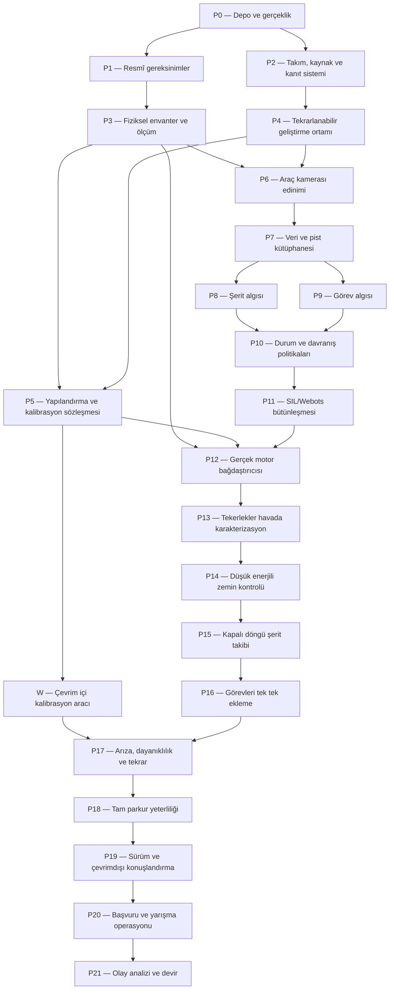

# STARTECH uçtan uca geliştirme yol haritası

> **Belge türü:** Kanıt kapılı, takvimden bağımsız proje yol haritası
>
> **Durum tarihi:** 22 Ağustos 2026
>
> **Kapsam:** Depo yönetimi, yarışma uygunluğu, kamera, görüntü işleme, durum makinesi,
> motor çıkışı, simülasyon, kalibrasyon sitesi, fiziksel test, başvuru, yarışma ve devir
>
> **Ana kural:** Bir faz, ay geçtiği için değil çıkış kanıtı kabul edildiği için biter.
>
> **Bu belge fiziksel aracı çalıştırma izni değildir.** Her canlı donanım işlemi için
> `AGENTS_READ_ME.txt` içindeki insan incelemesi, Egemen'in canlı donanım yetkisi ve
> tehlikeli adımdan hemen önce son onay sırası ayrıca uygulanır.

Bu yol haritası `SIRA.md` ve `Markdown/PLAN_New.md` yerine geçmez. Onların tarihsel ve
teknik bilgisini, mevcut kodun ilerlemiş durumuna göre uygulanabilir faz kapılarına
dönüştürür. Kaynaklar çelişirse yetki sırası `AGENTS_READ_ME.txt` içindedir.

---

## 1. Yol haritası nasıl kullanılacak?

Her faz aynı yedi soruyla yönetilir:

1. **Sonuç:** Faz sonunda hangi yeni yetenek veya bilgi gerçekten mevcut olacak?
2. **Giriş kapısı:** Başlamak için hangi önceki kanıtlar zorunlu?
3. **İş paketleri:** Kod, donanım, veri, belge ve insan işi olarak ne yapılacak?
4. **Durum dalları:** Beklenen, eksik, hatalı veya çelişkili sonuçta hangi yol izlenecek?
5. **Kanıt paketi:** Hangi test, ölçüm, klip, log, fotoğraf veya commit saklanacak?
6. **Çıkış kapısı:** Sonraki faza geçmek için kim neyi kabul edecek?
7. **Durdurma/geri dönüş:** Hangi belirti fazı durdurur ve güvenli önceki durum nedir?

Bir fazın görevleri paralel yapılabilir; çıkış kapısı atlanamaz. Fiziksel testlerde
`İKİ KİŞİ` ve `EGEMEN SON ONAYI` etiketleri kısaltma değil zorunlu prosedürdür.

### 1.1 Durum işaretleri

| İşaret | Anlamı |
|---|---|
| `DONE` | Belirtilen çıkış kanıtı mevcut ve insanlarca kabul edildi |
| `PARTIAL` | Bazı parçalar uygulandı; faz kapısı henüz kapanmadı |
| `NOT STARTED` | İş veya kanıt başlamadı |
| `BLOCKED` | Dış karar, donanım, erişim veya önceki faz kanıtı bekleniyor |
| `REPEAT` | Önceden geçti ama donanım, ortam, kod veya kural değiştiği için yeniden gerekir |
| `N/A` | Takım gerekçesiyle kapsam dışı bıraktı; neden ve etkisi kayıtlı |

LLM ajanı kendi başına `DONE` işareti koymaz. Otomatik test sonucu ve insan kabulü ayrı
alanlardır.

### 1.2 Kanıt seviyeleri

| Seviye | Kanıt | İddia sınırı |
|---|---|---|
| E0 | Fikir veya taslak | Yalnız `PROPOSED` denebilir |
| E1 | Statik inceleme/derleme | Kodun okunabildiği söylenebilir |
| E2 | Birim ve sözleşme testi | Yazılım sınırının belirli girdilerde çalıştığı söylenebilir |
| E3 | Kayıtlı veri veya simülasyon | Tekrarlanabilir yazılım davranışı söylenebilir |
| E4 | İnsan gözetimli tezgâh ölçümü | O düzenekte ölçülen elektrik/mekanik sonuç söylenebilir |
| E5 | Sınırlı fiziksel parkur deneyi | O pist ve koşulda araç davranışı söylenebilir |
| E6 | Körleştirilmiş/tam parkur tekrarları | Yarış adayı güvenilirliği hakkında sınırlı sonuç söylenebilir |
| E7 | Resmî teknik kontrol veya yarış koşusu | Yalnız o resmî olayın sonucu söylenebilir |

E2 testi E5 hareketi kanıtlamaz. Bir stop logu, tekerleğin durduğunu kanıtlamaz.

---

## 2. 22 Ağustos 2026 doğrulanmış başlangıç çizgisi

| Alan | Mevcut durum | Henüz kanıtlanmayan |
|---|---|---|
| ARDA CLI | Simülasyon öz denetimi ve fail-closed araç modu uygulanmış | Sürekli fiziksel sürüş döngüsü |
| KASIM | USB→Picamera2 açılış zinciri uygulanmış | Araçtaki Pi kamera ve montaj geometrisi |
| Dizüstü USB kamera | Üç kare, `640x480`, `usb:0` ile edinim gözlendi | Uzun süre, Pi performansı veya yarış ışığı |
| KEREM | İhtiyatlı simülasyon gözlemi sözleşmesi uygulanmış | Gerçek şerit ve görev algılayıcıları |
| DORA | Saf durum geçişi ve yasak geçiş testleri uygulanmış | Yarış görevlerinin tam politika seti |
| KADER | Bellek ve JSONL sözleşmeleri uygulanmış | Pi disk kotası, döndürme ve güç kaybı politikası |
| OSMAN | TAWNT kapısı, fake ve blocked sürücü uygulanmış | Herhangi bir gerçek GPIO/PWM bağdaştırıcısı |
| Webots | Beş doğrulanmış sanal hareket parçası ve stop çalışıyor | Gerçek aracın fiziksel modeli veya kalibrasyonu |
| Yapılandırma | Şemalar, örnekler ve doğrulama testleri var | Araç üzerinde ölçülmüş nihai iki JSON |
| Kalibrasyon web aracı | Tasarım/prototip ekranları var | Üretim uygulaması, güvenli giriş ve JSON iş akışı |
| Testler | 126 otomatik test 22 Ağustos 2026'da geçti | Fiziksel araç güvenilirliği |
| Belge kontrolü | Çalışıyor ve hatayı görünür yapıyor | `HATA_DEFTERI.md` içindeki `motor_balance.py` atfı çözülmedi |

Bu tablo değiştikçe bütün belgeyi yeniden yazmak gerekmez. Yeni kanıt, ilgili fazın
kanıt paketine ve görev sistemine eklenir.

---

## 3. Yarışma kaynağı ve kural değişikliği kapısı

22 Ağustos 2026 tarihinde resmî 2026 kategori sayfası; azami `20 × 30 × 25 cm`, azami
`10 cm` teker çapı, yalnız kamera algısı, Wi-Fi/Bluetooth/RF yasağı, takımın özgün
yazılımı ve dört dakikalık tur sınırını listeler:

- https://robot.meb.gov.tr/categories/autonomous-vehicle-2026
- https://robot.meb.gov.tr/organizasyon/uygulama-kilavuzu

Bunlar **2026 tarihli başlangıç kaynağıdır**. Bir sonraki yarışma için otomatik olarak
geçerli sayılmaz.

Yeni kılavuz veya resmî duyuru bulunduğunda:

1. Dosya/URL, yayın tarihi, indirme tarihi ve mümkünse hash kaydedilir.
2. Boyut, teker, ağırlık, pil, sensör, kamera, haberleşme ve başlatma kuralları karşılaştırılır.
3. Görevler, puanlar, süre, tur sayısı, takım sayısı ve başvuru belgeleri karşılaştırılır.
4. Değişiklikler `UNCHANGED`, `CHANGED`, `NEW`, `REMOVED`, `AMBIGUOUS` olarak işaretlenir.
5. `AMBIGUOUS` maddeler koordinatöre yazılı sorulur; sözlü cevap tarih/kişiyle kaydedilir.
6. Kural değişikliği çalışan tasarımı etkiliyorsa ilgili faz `REPEAT` olur.
7. Resmî kaynak ile okul beyanı çatışırsa geliştirme durur ve tam çatışma US'a gösterilir.

---

## 4. Bağımlılık görünümü



Kritik yol P0→P21'dir. Web aracı, belge/hesap işleri, yedek parça ve pist yapımı uygun
kapılardan sonra paralel yürür. Paralel olmak bağımlılıksız olmak değildir.

---

## 5. Bütün fazlarda değişmeyen çalışma akışı

Her görev kaydı en az şunları taşır:

- görev kimliği, faz ve sahibi,
- ana gerekçe ve beklenen sonuç,
- değişecek dosyalar/donanım,
- bağımlılıklar ve bilinmeyenler,
- risk seviyesi: `DESK`, `BENCH`, `WHEELS_UP`, `GROUND`, `COURSE`,
- yazılım ve fiziksel durdurma yolu,
- kullanılan commit ve yapılandırma damgası,
- çalıştırılan test/ölçüm,
- ham kanıt yolu,
- gözlenen sonuç ve beklenenden fark,
- karar: devam, düzelt, geri dön, kapsam dışı bırak,
- insan inceleyen ve tarih.

Fiziksel düzen değişirse önceki ölçümün kapsamı yeniden değerlendirilir. Kamera açısı,
motor, teker, sürücü, pil kimyası, şasi, çözünürlük veya ana yazılım sürümü değiştiğinde
ilgili kalibrasyonlar `REPEAT` olabilir.

---

# P0 — Depo, belge ve gerçeklik tabanı

**Mevcut durum:** `PARTIAL`

**Sonuç:** Ekip hangi dosyanın üretim, simülasyon, prototip, tarihsel referans veya kişisel
değişiklik olduğunu bilir; hiçbir çalışma yanlış başlangıç noktasından yapılmaz.

**Giriş kapısı:** Yok. Her yeni bilgisayarda ve uzun aradan sonra tekrar edilir.

**İş paketleri:**

- `PROJECT_MAP.md`, `AGENTS_READ_ME.txt`, bu dosya ve ilgili modül/test birlikte okunur.
- `git status --short`, branch, remote ve son doğrulanmış commit kaydedilir.
- İzlenen, değiştirilmiş, izlenmeyen ve üretilmiş dosyalar ayrı listelenir.
- Root `tawnt.py` ile `startech/tawnt/` ilişkisi doğrulanır; benzer isimli izlenmeyen
  dosya otomatik olarak kanonik sayılmaz.
- `LEGACY/` yalnız karşılaştırma kaynağı olarak etiketlenir.
- `kontrol.py`, testler ve pre-commit hook gerçek Python başlatıcısıyla denenir.
- Gizli değer, parola, kişisel veri veya kalibrasyon görüntüsü için Git taraması planlanır.
- Bozuk/eskimiş belge iddiaları koddan ayrı hata listesine alınır.

**Durum dalları:**

- Çalışma ağacı kirliyse: sahiplik belirlenene kadar dosya silinmez, taşınmaz veya stage edilmez.
- İki dosya aynı işi iddia ediyorsa: import zinciri, test ve Git geçmişi incelenir; US karar verir.
- Hook çalışmıyorsa: sebep kaydedilir, eşdeğer kontrol doğrudan çalıştırılır; sonuç gizlenmez.
- Uzak depo erişilemiyorsa: yerel çalışma yapılabilir; yedek ve paylaşım kapısı kapanmaz.
- Belge ile kod çatışıyorsa: ikisi de sessizce düzeltilmez; mevcut gerçek ve önerilen karar yazılır.

**Kanıt paketi:** Git durum çıktısı, remote listesi, test özeti, belge kontrol sonucu,
korunan kullanıcı dosyaları listesi.

**Çıkış kapısı:** Ekip tek cümlede üretim Python yolunu, simülasyon yolunu ve değiştirilmemesi
gereken kullanıcı dosyalarını gösterebilir.

**Durdurma/geri dönüş:** Dosya sahipliği belirsizse değişiklik durur. Geri dönüş, yalnız
okuma ve ayrı çalışma planıdır; `reset --hard` değildir.

---

# P1 — Resmî gereksinim ve başarı tanımı

**Mevcut durum:** `PARTIAL`; 2026 tabanı var, sonraki yarışma kılavuzu yok.

**Sonuç:** Araç “çalışıyor” gibi belirsiz bir hedef yerine, teknik kontrol, güvenlik,
görev, puan, süre ve takım hedefleriyle ölçülebilen gereksinimlere sahiptir.

**Giriş kapısı:** P0.

**İş paketleri:**

- En güncel uygulama ve kategori kılavuzu arşivlenir.
- Her kural için kaynak sayfa/madde, yorum ve doğrulama sahibi yazılır.
- `MUST`, `SHOULD`, `OPTIONAL`, `FORBIDDEN`, `AMBIGUOUS` matrisi hazırlanır.
- Teknik kontrol listesi: boyut, teker, pil, sensör, haberleşme, QR, başlatma, güvenlik.
- Yarış başarısı üç seviyeye ayrılır:
  - **R0 güvenli katılım:** teknik kontrol + güvenli çevrimdışı başlatma,
  - **R1 temel koşu:** güvenilir şerit takibi + bitiş,
  - **R2 puan paketi:** seçilmiş görevler,
  - **R3 tam hedef:** takımın kabul ettiği bütün görevler ve süre hedefi.
- Her görevin değer/zorluk/risk oranı yeni puan tablosuyla yeniden hesaplanır.
- Takım kendi minimum kabul hedefini kılavuzdan ayrı yazar.

**Durum dalları:**

- Yeni kılavuz yoksa: yalnız E0–E3 masa başı işleri yapılır; satın alma ve mekanik kararlar
  2026 tabanı + değişiklik payıyla geçici tutulur.
- Kural belirsizse: koordinatöre yazılı soru; cevap gelene kadar en kısıtlayıcı güvenli yorum.
- Kural tasarımla çatışırsa: etkilenen faz `BLOCKED`; yarışma dışı deney ayrı etiketlenebilir.
- Puanlar değişirse: görev önceliği yeniden seçilir; temel şerit takibi ve güvenlik atılmaz.
- Takım kategoriyi değiştirirse: bu yol haritası otomatik taşınmaz; yeni kapsam gerekir.

**Kanıt paketi:** Kural fark tablosu, kaynak arşivi/hash'i, açık sorular ve yazılı cevaplar,
takım hedef belgesi.

**Çıkış kapısı:** Teknik kontrol ve minimum yarış adayı hedefinde cevapsız kritik madde yoktur.

**Durdurma/geri dönüş:** Diskalifiye riski doğuran belirsizlik çözülmeden etkilenmiş donanım
satın alınmaz veya üretim yazılımına bağlanmaz.

---

# P2 — Takım, sorumluluk, zaman ve kaynak sistemi

**Mevcut durum:** `PARTIAL`.

**Sonuç:** İş tek kişiye, tek cihaza veya “biri yapar” varsayımına bağlı değildir.

**Giriş kapısı:** P0; P1 ile paralel yürür.

**İş paketleri:**

- Her iş için birincil sahip, inceleyen ve yedek kişi belirlenir.
- Kod, mekanik, elektrik, pist/veri, kalibrasyon, belge/başvuru ve yarış rolleri ayrılır.
- İki kişilik fiziksel testler için uygun ortaklar belirlenir.
- Haftalık takvim yerine hazır iş kuyruğu tutulur: araçsız, araçlı, internetli, atölyeli işler.
- Parça listesinde model, adet, neden, teslim tarihi, test tarihi ve yedek durumu tutulur.
- Hesap sahipliği: Git, alan adı, Vercel, R2/VPS ve kurtarma yolları yazılır.
- SUBIRU kullanılacaksa kanıtsız `done` engellenir; kullanılmayacaksa aynı alanları taşıyan
  basit görev dosyası seçilir.
- Öğrenciler değişiklikleri öğretmene/jüriye açıklayacak kısa teknik anlatımı dönüşümlü yapar.

**Durum dalları:**

- Bir kişi yoksa: tek kişilik masa başı işler sürer; fiziksel hareket ve geri dönüşsüz iş durur.
- Okula/arabaya erişim yoksa: kayıtlı veri, simülasyon, test, site ve dokümantasyon kuyruğu açılır.
- Bütçe yetersizse: güvenlik/yedek parçalar korunur, opsiyonel ikinci kamera ve analiz ürünü ertelenir.
- Yeni üye gelirse: önce okuma ve sahte sürücü görevi; doğrudan canlı motor sorumluluğu verilmez.
- Sahip işi bırakırsa: kanıt ve erişim devri yapılmadan görev `DONE` sayılmaz.
- Zaman daralırsa: §9'daki kapsam merdiveni uygulanır; rastgele özellik kesilmez.

**Kanıt paketi:** Sorumluluk matrisi, hazır iş kuyruğu, hesap kurtarma kontrolü, satın alma ve
yedek listesi.

**Çıkış kapısı:** Kritik her işin sahibi ve yedeği; kritik her hesabın kurtarma yolu vardır.

**Durdurma/geri dönüş:** Tek kişi bağımlılığı tespit edilirse ilgili yüksek riskli faz açılmaz.

---

# P3 — Fiziksel araç envanteri ve güç verilmeden ölçüm

**Mevcut durum:** `BLOCKED` — araç okulda.

**Sonuç:** Kodun ihtiyaç duyduğu bütün fiziksel gerçekler fotoğraf, şema ve ölçümle bilinir.

**Giriş kapısı:** P1, P2; araç erişimi. Motor ve Pi gücü kapalı.

**İş paketleri:**

- Şasi ölçüleri, teker çapı, ağırlık ve QR alanı kaydedilir.
- Raspberry Pi, kamera, motor, sürücü kartı, regülatör, pil ve anahtar modelleri okunur.
- Her kablo iki uçtan izlenir; GPIO/pin adı tahmin edilmez.
- L298N veya gerçek kartta kanal→motor eşlemesi çizilir.
- Motor ve Pi güç yolları, ortak toprak, sigorta/koruma ve anahtar erişimi çizilir.
- Kamera yüksekliği, eğimi, dönüklüğü ve mekanik sabitliği ölçülür.
- Yasak sensör veya haberleşme donanımı iki kişiyle fiziksel olarak kontrol edilir.
- Pil hücre sayısı, kimyası, nominal değer, durum ve şarj yöntemi kaydedilir.
- Fiziksel acil durdurma provası güç vermeden yapılır.

**Durum dalları:**

- Etiket okunmuyorsa: fotoğraf + ölçüm + datasheet araştırması; model kesin diye yazılmaz.
- Kablolama şeması gerçekle çatışıyorsa: gerçek kablo izleme geçici kanıt olur; şema ayrı
  onayla güncellenir.
- Gevşek/çıplak kablo, şişmiş pil veya hasarlı sürücü varsa: güç testi yapılmaz; onarım fazı açılır.
- Ölçüler sınırı aşıyorsa: yazılımdan önce mekanik yeniden tasarım kararı verilir.
- Yasak modül varsa: yarış düzeninden fiziksel olarak çıkarma planı; yazılımla kapatmak yeterli değildir.
- Anahtarlara hızlı erişilemiyorsa: fiziksel test `BLOCKED`.
- İki motor aynı kanala beklenmedik biçimde bağlıysa: akım ve sürücü kapasitesi doğrulanmadan devam edilmez.

**Kanıt paketi:** Tarihli envanter, ölçüm tablosu, üst/alt fotoğraflar, pin/kablo şeması,
güç ağacı ve imzalı güçsüz acil durum provası.

**Çıkış kapısı:** P12'de gerçek sürücüyü yazmak için gereken model/pin/yön/frekans
bilgilerinin kaynağı bellidir; henüz ölçülmeyen elektrik değerleri açık işaretlidir.

**Durdurma/geri dönüş:** Hasar, belirsiz güç yolu veya erişilemeyen anahtar bulunursa güç
verilmez. Geri dönüş, fiziksel onarım ve yeniden P3 incelemesidir.

### P3A — İsteğe bağlı LEGACY ucuz teşhis dalı

Bu dal yeni üretim mimarisinin kapısı değildir; önceki kalibrasyon arızası adaylarını hızlı
öğrenmek içindir. Ayrı onaylı plan gerektirir.

- Perspektif ve trim hataları kod incelemesiyle ayrılır.
- `KI=0` tutulur; önce yalnız perspektif, sonra yalnız trim değiştirilir.
- Aynı pist, kamera, pil durumu ve ölçüm yöntemiyle önce/sonra kayıt alınır.
- Başarılı sonuç davranış bilgisidir; LEGACY mimarisini otomatik olarak üretim yapmaz.
- Tehlikeli veya açıklanamayan davranışta dal kapanır; yeni sisteme rastgele sabit taşınmaz.

---

# P4 — Tekrarlanabilir geliştirme, test ve Pi kurtarma ortamı

**Mevcut durum:** `PARTIAL` — Windows test ortamı çalışıyor; Pi ortamı bilinmiyor.

**Sonuç:** Yeni veya yedek bir bilgisayar/Pi, belgelenmiş adımlarla aynı kodu test edebilir.

**Giriş kapısı:** P0, P2; Pi kısmı için P3.

**İş paketleri:**

- Gerçek Python ve işletim sistemi sürümleri kaydedilir.
- `requirements.txt`, kamera ve geliştirme gereksinimleri rollerine göre doğrulanır.
- Windows, Linux ve Raspberry Pi kurulum komutları ayrılır.
- Test, derleme, TAWNT taraması ve belge kontrolü tek doğrulama listesinde toplanır.
- Webots kurulum/smoke yolu ve Webots'suz birim test yolu tutulur.
- Pi SD kartının çalışan imajı, geri yükleme ve ilk açılış testi yapılır.
- Saat, yerel saat dilimi, dosya izinleri ve disk boşluğu davranışı doğrulanır.
- Ağsız açılış ve yerel bağımlılıkların bulunabilirliği denenir.
- Servis henüz aracı sürmeden yalnız blocked/fake modda çalıştırılır.

**Durum dalları:**

- `python` Store alias'a gidiyorsa: `py`/gerçek yorumlayıcı kullanılır; hook sonucu ayrıca raporlanır.
- Pi paketi Windows'ta yoksa: tembel import ve sahte test kullanılır; platform paketi zorla pip'e eklenmez.
- Webots yoksa: `arac/simulasyon.py` testleri sürer; görsel smoke `NOT RUN` yazılır.
- İnternet yoksa: kilitli yerel bağımlılık/yedek kurulum yolu kullanılır; araç başlangıcı ağ beklemez.
- SD imajı açılmazsa: yedek sayılmaz; yeniden üretim tamamlanmadan P19 kapanmaz.
- Sürümler farklı sonuç verirse: desteklenen matris daraltılır veya fark testle belgelenir.

**Kanıt paketi:** Temiz kurulum günlüğü, sürüm listesi, 126+ test sonucu, Webots smoke,
SD yedekleme ve geri yükleme kanıtı.

**Çıkış kapısı:** En az iki ortamda yazılım testleri; Pi'de ağsız blocked/fake başlangıç;
test edilmiş bir kurtarma ortamı.

**Durdurma/geri dönüş:** Kurulum yalnız tek kişinin cihazında çalışıyorsa fiziksel entegrasyon
devam edebilir ama sürüm adayı kapısı kapanmaz.

---

# P5 — Yapılandırma, kalibrasyon ve değer kökeni

**Mevcut durum:** `PARTIAL` — şema/örnek/doğrulama var; gerçek araç JSON'ları yok.

**Sonuç:** Her kritik değer ölçüm veya takım kararı kökeniyle yüklenir; yanlış veya uyumsuz
yapılandırma motorları kapalı tutar.

**Giriş kapısı:** P3, P4.

**İş paketleri:**

- `kalibrasyon.json` ile `ayarlar.json` sahipliği kesinleştirilir.
- Motor trimlerinin hangi dosyada olacağı US kararıyla kapatılır.
- Her alan için ad, tür, birim, sınır, köken, tarih ve donanım sürümü tanımlanır.
- `ayar.py` veya eşdeğer tek üretim doğrulayıcı planlanır.
- Çözünürlük↔perspektif, hız↔ölü bölge↔tavan ve renk örtüşmesi birlikte doğrulanır.
- Atomik yazım, hash/damga, sürüm yükseltme ve eski sürüm reddi uygulanır.
- Bilinmeyen değer `null`/`UNVERIFIED` kalır; örnek sayı ölçülmüş görünmez.
- Araç açılışında iki dosyanın aynı donanım/şema/damga ailesine ait olduğu kontrol edilir.
- Kalibrasyon eskime tetikleyicileri belirlenir: kamera hareketi, çözünürlük, motor, teker,
  sürücü, pil, pist yüzeyi ve ışık değişimi.

**Durum dalları:**

- Dosya yok/bozuk/hash yanlışsa: araç modu açılmaz; hata ve beklenen düzeltme gösterilir.
- Şema yeni, araç kodu eskiyse: sessiz alan yutma yok; açık sürüm hatası.
- İki dosya farklı damgadaysa: sonuncuyu tahmin etme; eşleşen çift seçilir.
- Ölçüm yapanlar farklı sonuç bulursa: düzen ve yöntem karşılaştırılır; ortalama uydurulmaz.
- Trim henüz ölçülmediyse: fiziksel sürüş hedefi daraltılır; `1.0 measured` yazılmaz.
- Kalibrasyon sitesi çevrimdışıysa: yerel JSON üretim/yükleme yolu çalışmaya devam eder.

**Kanıt paketi:** Geçerli ve her ana hata türü için geçersiz örnekler, şema testleri,
ölçüm kayıtları, damga/hash ve insan tarafından okunmuş nihai özet.

**Çıkış kapısı:** Üretim doğrulayıcı hem doğru dosyayı kabul eder hem de yanlış çözünürlük,
eski sürüm, bozuk hash, bilinmeyen alan ve tutarsız hız takımını reddeder.

**Durdurma/geri dönüş:** Yapılandırma hatası fiziksel varsayılana düşmez. Son bilinen iyi
sürüm yalnız donanım kimliği ve hash'i eşleşiyorsa insan kararıyla seçilebilir.

---

# W — Çevrim içi kalibrasyon aracı paralel yolu

**Mevcut durum:** `PARTIAL` — Figma/HTML prototipleri var; üretim uygulaması yok.

**Sonuç:** Windows'a bağlı olmayan bir tarayıcı, kamera görüntüsü veya yüklenen kare ile
şemaya uygun kalibrasyon JSON'u üretir; araç çalışma zincirine bağlanmaz.

**Giriş kapısı:** P1'in kural ayrımı, P4 geliştirme ortamı, P5 şema sözleşmesi.

**İş paketleri:**

- Prototip ekranları gerçek kullanıcı akışına çevrilir: giriş, kaynak seçimi, kamera,
  perspektif, renkler, motor ölçüm alanı, doğrulama, önizleme, dışa aktarma.
- Parola yalnız Vercel server-side environment variable'da tutulur; istemci bundle'ına,
  Git'e, `server.json`a veya token dosyasına yazılmaz.
- İstemci gönderdiği parolayla güvenli serverless endpoint'e gider; başarılı oturum kısa
  süreli `HttpOnly`, `Secure`, uygun `SameSite` cookie kullanır.
- Karşılaştırma sabit süreli yapılır; hız sınırlama ve kaba kuvvet kaydı eklenir.
- İsim/e-posta ekranda kalırsa güvenlik kimliği sayılmaz; e-posta servisi ayrı karar olmadan eklenmez.
- Kamera erişimi `getUserMedia` ile yalnız kullanıcı eyleminden sonra istenir; reddedilirse
  dosya yükleme yolu sunulur.
- Görüntü varsayılan olarak tarayıcıda işlenir; sunucuya gönderilecekse açık rıza, saklama
  süresi ve silme yolu gerekir.
- Aynı JSON şeması hem istemcide hızlı geri bildirim hem server-side son doğrulama için kullanılır.
- Çıktı indirilebilir ve ağsız Pi aktarımına uygun olur; site Pi'ye canlı komut göndermez.
- Dil, klavye erişimi, mobil/masaüstü düzeni, hatalar ve oturum süresi test edilir.
- Vercel preview ve production ortamları farklı parola/ayar kullanır.

**Durum dalları:**

- Tarayıcı kamera iznini reddederse: dosya yükle; güvenlik ayarını aşmaya çalışma.
- CSI kamera tarayıcıdan görünmezse: Pi yerel yakalama ile dosya üret; siteye doğrudan CSI vaadi verme.
- Vercel environment variable eksikse: giriş fail-closed; test parolasına düşme.
- Site/ağ yoksa: yerel doğrulama ve JSON indirme/yedek yoluyla çalışma sürer.
- Şema değişirse: eski taslak açıkça uyumsuz gösterilir; sessiz dönüştürme yok.
- Parola sızarsa: environment secret döndürülür, oturumlar geçersiz kılınır, Git geçmişi taranır.
- Kötü dosya yüklenirse: boyut/tür/çözünürlük sınırı; aktif içerik çalıştırılmaz.
- Kullanıcı yarıda çıkarsa: taslak yalnız açık kullanıcı seçimiyle yerelde tutulur.

**Kanıt paketi:** Figma↔uygulama ekran karşılaştırması, auth testleri, şema testleri,
kamera izin/red testleri, Linux tarayıcı denemesi, erişilebilirlik kontrolü ve örnek JSON.

**Çıkış kapısı:** Linux ve Windows'ta aynı geçerli JSON üretilebilir; yanlış parola ve bozuk
dosya reddedilir; kaynakta veya istemci çıktısında secret yoktur; araç site olmadan başlar.

**Durdurma/geri dönüş:** Auth veya secret sınırı kanıtlanmadıysa site internete açılmaz.
Site arızası araç geliştirmesini bloke etmez; yerel araç korunur.

---

# P6 — Gerçek kamera edinimi ve zaman davranışı

**Mevcut durum:** `PARTIAL` — laptop USB geçti; Pi kamera `BLOCKED`.

**Sonuç:** Araç kamerası motor gücü kapalıyken güvenilir, sonlu ve ölçülmüş kare akışı verir.

**Giriş kapısı:** P3 kamera envanteri, P4 Pi ortamı, P5 kamera profili. Motor gücü kapalı.

**İş paketleri:**

- Picamera2/USB cihazı, kaynak adı, çözünürlük, biçim, FPS ve açılış süresi ölçülür.
- Önce 1 kare, sonra 10 kare, sonra süre sınırlı soak yapılır.
- `frame_id`, monotonic zaman, çözünürlük ve kaynak tutarlılığı kaydedilir.
- USB-first→Pi fallback yalnız açılış başarısızlığında doğrulanır.
- Açılmış kameradaki okuma hatasının sessiz kaynak değiştirmediği doğrulanır.
- Kamera çıkarma, kapatma, yeniden açma ve süreç kesme senaryoları denenir.
- Kare kuyruğu ve maksimum kabul edilebilir kare yaşı tanımlanır.
- Pozlama, beyaz dengesi ve FPS otomatik/sabit stratejisi veriyle seçilir.
- Kamera montajı işaretlenir; gevşeme kolay fark edilir hâle getirilir.

**Durum dalları:**

- USB ve Pi ikisi de yoksa: `CameraUnavailable`; sürüş başlangıcı yok.
- USB bağlı ama yanlış kameraysa: indeks/kaynak kimliği açıkça seçilir; görüntü içeriğinden
  “herhalde bu” denmez.
- Açılış başarılı, kare boşsa: `CameraReadFailure`; eski kareyi tekrar verme.
- Çözünürlük değişirse: kalibrasyon geçersiz; P5 `REPEAT`.
- FPS hedefin altındaysa: önce profil/işleme yükü ölçülür; sahte FPS raporlanmaz.
- Kablo temassızsa: fiziksel onarım; yazılım retry fırtınasıyla gizlemez.
- Pi ısınır/brownout olursa: P3 güç ve P17 dayanıklılık dalına dönülür.

**Kanıt paketi:** Kaynak, model, OS/paket sürümü, çözünürlük/FPS dağılımı, açılış/okuma
gecikmesi, hata enjeksiyon logu, montaj ölçümü ve test tarihi.

**Çıkış kapısı:** Araç kamerası en az takımca seçilen soak boyunca kaynaksız/boş/eski kareyi
geçerli saymadan çalışır; kapanıştan sonra yeniden açılabilir.

**Durdurma/geri dönüş:** Kare kökeni belirsiz, montaj gevşek veya kalibrasyon çözünürlüğü
uyumsuzsa canlı algı entegrasyonu başlamaz.

---

# P7 — Pist, veri toplama, etiketleme ve sabit test kütüphanesi

**Mevcut durum:** `NOT STARTED`.

**Sonuç:** Algoritmalar, rastgele seçilmiş güzel kareler yerine temsil edici ve ayrılmış
bir veri kütüphanesinde ölçülür.

**Giriş kapısı:** P1 görev tanımları, P6 doğrulanmış araç kamerası. Araç hareketi şart değildir.

**İş paketleri:**

- Modüler mini pist: düz, sağ/sol viraj, kesikli çizgi, gölge, parlama ve güvenli boş alan.
- Kılavuza göre ölçekli ışık, tabela, araç maketi, geçit, tümsek ve park örnekleri.
- Veri manifesti: klip kimliği, tarih, kamera profili, pist, ışık, pil/araç düzeni ve amaç.
- İnsan etiket şeması: şerit merkezi/sınırı, görünürlük, görev türü, mesafe bölgesi,
  engel, belirsizlik ve etiketleyen kişi.
- Eğitim/ayar, doğrulama ve kilitli test kümeleri ayrı tutulur.
- Aynı koşunun ardışık kareleri farklı kümelere rastgele bölünmez; veri sızıntısı önlenir.
- Hata kütüphanesi: bulanık, karanlık, aşırı pozlanmış, kısmi şerit, yanlış renk, bozuk dosya.
- Kişisel veri görünürse kırpma/silme ve saklama politikası uygulanır.
- Telefon görüntüsü yalnız genel fikir için; araç kamerası perspektif kanıtı yerine kullanılmaz.

**Durum dalları:**

- Araç yoksa: var olan görüntüler sınıflandırılır, sentetik Webots veri yalnız ayrı etiketle kullanılır.
- Pist alanı yoksa: kısa modüler parçalar ve masa üstü kamera düzeneği; tam tur iddiası yok.
- Etiketçiler anlaşamazsa: örnekler birlikte yeniden tanımlanır; çoğunluk otomatik gerçek sayılmaz.
- Bir sınıf azsa: hedefli kayıt toplanır; aynı görüntüyü çoğaltmak çeşitlilik sayılmaz.
- Kamera profili değişirse: eski veri silinmez; profil alanıyla ayrılır ve yeni test seti eklenir.
- Veri bozulur/kaybolursa: manifest hash'i ve yedek kopya üzerinden kurtarılır.

**Kanıt paketi:** Manifest, etiket kılavuzu, sınıf/koşul dağılımı, hash'ler, kilitli test
listesi ve kullanım izinleri.

**Çıkış kapısı:** Her hedef davranışta başarı ve en az bir zor/hata örneği vardır; test kümesi
ayar sırasında değiştirilmez.

**Durdurma/geri dönüş:** Veri kökeni, kamera profili veya etiket tanımı bilinmiyorsa performans
yüzdesi yayımlanmaz.

---

# P8 — KEREM şerit algısı ve görüntü sağlık kararı

**Mevcut durum:** `PARTIAL` — veri sözleşmesi var, gerçek algı yok.

**Sonuç:** KEREM gerçek kareden şerit hatası, güven ve geçerlilik üretir; bilinmeyeni yol
açık diye yorumlamaz.

**Giriş kapısı:** P5 kamera/perspektif profili, P7 kilitli veri.

**İş paketleri:**

- Ön işleme: çalışma çözünürlüğü, ROI, HSV/gri ton, gürültü ve kontrast adımları ölçülür.
- Perspektif dönüşümü yalnız eşleşen çözünürlük/profille uygulanır.
- Histogram, süreklilik, tek kenardan merkez ve önceki merkez hafızası LEGACY'den davranış
  olarak değerlendirilir; kod körlemesine kopyalanmaz.
- Şerit merkezi, normalize hata, güven, kullanılan kanıt ve hata nedeni tek `Observation`da tutulur.
- Kesikli çizgi, tek sınır, kısa kayıp ve uzun kayıp ayrı politikalara sahip olur.
- Eski kare, tekrar kare, NaN, boş maske ve imkânsız geometri reddedilir.
- Kare başına süre, p50/p95/en kötü gecikme ve bellek kullanımı ölçülür.
- Debug önizlemesi üretim kararından ayrılır; çizilmiş görüntü algıya geri verilmez.

**Durum dalları:**

- İki sınır görünürse: merkez ve genişlik tutarlılığıyla güven üret.
- Tek sınır görünürse: kalibre şerit genişliğiyle tahmin, daha düşük güven ve süre sınırı.
- Kısa kayıpta: son yön bilgisi yalnız tanımlı süre boyunca ve azaltılmış hız politikası için kullanılabilir.
- Uzun kayıpta: `valid=False`; sürüş komutu yok/stop isteği.
- Gölge beyaz şerit sanılırsa: veri/maske düzeltmesi; yalnız eşik genişletme ile başka koşulu bozma.
- İşleme yetişmezse: eski kare kuyruğu büyütme; son kare politikası ve düşük maliyetli profil.
- Kilitli test gerilerse: yeni algoritma merge edilmez; koşula göre ayrı profil ancak kanıtla.

**Kanıt paketi:** Test manifesti, şerit hata metriği, geçerli/bilinmeyen oranı, yanlış güven
örnekleri, gecikme dağılımı ve önce/sonra görselleri.

**Çıkış kapısı:** Takımın P1'de seçtiği hata/güven/gecikme hedefi kilitli testte sağlanır;
her başarısız örneğin kategorisi bilinir. Eski plandaki `%95` yalnız veri ve “makul merkez”
tanımı sabitlenirse başlangıç hedefi olabilir.

**Durdurma/geri dönüş:** Yanlış negatif “şerit var” kararı fiziksel testte görülürse P8'e
dönülür; kontrol kazancı ile algı hatası gizlenmez.

---

# P9 — Görev ve nesne algısı

**Mevcut durum:** `NOT STARTED` — yalnız sözleşme alanları mevcut.

**Sonuç:** Trafik ışığı, geçitler, tümsek, sollama izni/araçları, çıkmaz yol, park rengi ve
bölge işaretleri ayrı kanıt ve güvenle tanınır.

**Giriş kapısı:** P1 güncel görevler, P7 görev verisi, P8 görüntü sağlık temeli.

**İş paketleri:**

- Her görev için algılanacak nesne, gereken mesafe/zaman ve kabul penceresi yazılır.
- Tabela modeli kullanılırsa model sürümü, eğitim verisi, sınıf listesi ve giriş boyutu sabitlenir.
- Klasik CV renk/şekil algısı ile ML tabela sınıflandırması açık sınırlarla ayrılır.
- `sign_type` üretici-tüketici sözleşmesi tek enum/şemaya bağlanır.
- Turuncu hedef ve sarı tuzak aynı karelerde test edilir.
- Debounce/histerezis; tek kare yanlışını göreve çevirmeyecek şekilde ölçülür.
- Mesafe gerektiren davranış için kamera geometrisi ve hata payı kaydedilir.
- Her algı `unknown/ambiguous` üretebilir; zorla sınıf seçmek gerekmez.
- Aynı karede birden fazla görev işareti ve görev sırası değişimi test edilir.

**Durum dalları:**

- Güven düşükse: görevi tetikleme; güvenli temel şerit davranışı veya stop politikası.
- İki sınıf benzerse: daha fazla veri/ikinci kanıt; puan için güvenlik kuralını gevşetme.
- Tabela var ama durum için geçersizse: DORA olayı reddeder, KADER kaydeder.
- Görev kaldırıldıysa: kod yolu devre dışı ve testleri arşivli; gizli tetik bırakılmaz.
- Model Pi'de yavaşsa: küçültme/klasik yöntem/kapsam dışı bırakma; kare yaşını ihlal etme.
- Tuzak araç hedef sanılırsa: sollama fazı `BLOCKED`; renk eşiğini saha verisiyle ayır.

**Kanıt paketi:** Görev başına karışıklık matrisi, yanlış negatif/pozitif, mesafe hatası,
gecikme, model/hash ve başarısız örnek galerisi.

**Çıkış kapısı:** Her dahil görev, kilitli veride tanımlı metrik ve belirsizlik davranışına
sahiptir; dışlanan görevler P1 kapsam listesinde açıkça işaretlidir.

**Durdurma/geri dönüş:** Tuzak/izin ayrımı veya kırmızı park güvenilir değilse ilgili fiziksel
görev denenmez; temel şerit takibine dönülür.

---

# P10 — DORA durum makinesi ve görev politikaları

**Mevcut durum:** `PARTIAL` — genel geçiş motoru var, yarış politikası eksik.

**Sonuç:** Görev sırası değişse de her olayın hangi durumda ne yapacağı belirlenmiş ve
yasak geçişleri test edilmiştir.

**Giriş kapısı:** P1 görev gereksinimleri, P8/P9 gözlem sözleşmeleri.

**İş paketleri:**

- Üst durumlar: açılış, self-test, hazır/silahsız, tetik bekleme, görev, stopping, finished, fault.
- Görev alt durumları güncel kılavuza göre modellenir; sabit A→B→C sırası kullanılmaz.
- Her olay için üretici, kanıt, kabul durumları, hedef durum, timeout ve kayıt alanı yazılır.
- Tek seferlik görevlerin yeniden tetiklenme ve reset davranışı belirlenir.
- Debounce ile durum geçişi aynı yerde iki kez uygulanmaz.
- Stop, resume ve reset yalnız izinli insan/politika kapılarından geçer.
- `FAULT` veya `STOPPING`den doğrudan `DRIVING` kestirmesi yoktur.
- Olay önceliği belirlenir: fiziksel/sağlık hatası görev puanından önce gelir.
- DORA motor değeri üretmez; davranış niyeti ARDA/denetleyiciye gider.

**Durum dalları:**

- Aynı anda iki görev görülürse: belgelenmiş öncelik; ikisini sırayla varsayma.
- Beklenen görev gelmezse: temel şerit takibi veya timeout; gizli sayaçla sahte tamamlanma yok.
- Eski/tekrar olay gelirse: durum değişmez, neden kaydedilir.
- Kamera/algı geçersizse: fault/stop politikası; önceki iyi olayla devam yok.
- Reset istenir ama motor gücü/insan şartı yoksa: ret ve kilit korunur.
- Kılavuz görev sırasını değiştirirse: veri ve senaryo testleri `REPEAT`; merkez durum yapısı korunabilir.

**Kanıt paketi:** Durum diyagramı, geçiş tablosu, her izinli/yasak geçiş testi, timeout ve
aynı anda olay senaryoları.

**Çıkış kapısı:** Bütün dahil görevlerin normal, tekrar, sıra değişimi, timeout ve fault yolu
deterministiktir; hiçbir durum doğrudan fiziksel motor yazmaz.

**Durdurma/geri dönüş:** Açıklanamayan veya nondeterministik geçiş bulunursa ARDA fiziksel
bütünleşmesi ilerlemez.

---

# P11 — ARDA yazılım-içinde-döngü, Webots ve KADER bütünleşmesi

**Mevcut durum:** `PARTIAL` — bir karelik probe ve görsel motor demosu var.

**Sonuç:** Tam kontrol zinciri fiziksel araç olmadan sonlu senaryolarda çalışır; hata yolları
son komutu korumaz.

**Giriş kapısı:** P8, P9, P10; P5 şema. P12 gerekmez.

**İş paketleri:**

- Sıra sabitlenir: frame→observation→state→intent→MotorRequest→TAWNT→Fake/Blocked→KADER.
- Kayıtlı klip sürücüsü eklenir; gerçek zaman ve hızlı deterministik replay modları ayrılır.
- Webots controller aynı üst düzey politika girişlerini kullanır; ikinci üretim `main.py` oluşmaz.
- Watchdog, maksimum kare yaşı, döngü süresi ve queue politikası simülasyonda sınanır.
- Hata enjeksiyonu: kamera yok/boş/eski, algı exception, illegal state, TAWNT ret, driver ret,
  disk hata, SIGINT, beklenmeyen exception.
- En dış `try/finally` stop/close ister; bunun fiziksel stop kanıtı olmadığı logda açıktır.
- KADER aynı zaman çizgisinde frame, gözlem, durum, istek, uygulama sonucu ve fault tutar.
- Senaryolar deterministik seed/manifest ile tekrar edilir.
- Her uzun test sonlu süre/iterasyona sahiptir; sonsuz “bakalım ne olacak” koşusu yoktur.

**Durum dalları:**

- Webots fizik ile pose modeli ayrışırsa: kalibrasyon iddiası yapılmaz; politika ve cihaz komutu ayrı incelenir.
- Fake driver kabul edip TAWNT reddediyorsa: test yanlış bağlanmıştır; TAWNT atlanmaz.
- Log diski simülasyonda hata verirse: fail-closed politika doğrulanır; test logu kanıt olmadan “geçti” denmez.
- Replay canlı hızda yetişmezse: gecikme nedeni P8/P9'a döner; frame drop politikası ölçülür.
- Senaryo nondeterministikse: saat/random/dış kaynak izole edilir; flaky test kapıya kabul edilmez.
- Fiziksel API yanlışlıkla import edilirse: statik tarama ve mimari test fail eder.

**Kanıt paketi:** Senaryo manifestleri, beklenen/gerçek event dizileri, Webots smoke,
performans dağılımı, hata enjeksiyon sonuçları ve KADER örnek koşusu.

**Çıkış kapısı:** Normal ve bütün kritik hata senaryoları E3 düzeyinde tekrar edilebilir;
TAWNT taraması `arac/` içinde izinsiz motor yazımı bulmaz.

**Durdurma/geri dönüş:** Herhangi bir hata son geçerli hareket isteğini sınırsız koruyorsa
P11 kapanmaz; fiziksel motor fazı açılamaz.

---

# P12 — OSMAN gerçek motor bağdaştırıcısının yazılması

**Mevcut durum:** `NOT STARTED`; `BlockedMotorDriver` aktif güvenli sınırdır.

**Sonuç:** Ölçülmüş donanım gerçeklerine göre yazılmış motor bağdaştırıcısı vardır; varsayılan
olarak off'tur ve henüz zemin sürüşü yapmaz.

**Giriş kapısı:** P3 pin/model/güç bilgisi, P5 doğrulanmış değer yapısı, P11 hata yolları;
ayrı kod planı ve insan incelemesi.

**İş paketleri:**

- GPIO/PWM kütüphanesi Raspberry Pi modeli ve sürücü kartına göre seçilir.
- Bütün donanım import/yazımı yalnız OSMAN gerçek adapter içinde tutulur.
- Constructor pinleri güvenli off durumuna getirir; hareket üretmez.
- Yalnız `ValidatedDriveRequest` kabul edilir; faz, arm, watchdog ve değer kökeni tekrar kontrol edilir.
- Sol/sağ yön, enable/PWM, frekans, fren/coast ve aktif seviye yapılandırmadan gelir.
- İki kanaldan biri yazılırken diğeri hata verirse atomik olmasa bile hemen iki yana stop isteği ve fault üretilir.
- `stop()`/`close()` idempotent ve exception durumunda çağrılabilir olur.
- Donanım yokken sahte GPIO/PWM adapter ile bütün çağrı sırası test edilir.
- Fiziksel adapter hiçbir zaman sessiz varsayılan olmaz; açık seçim ve live profil gerekir.
- Import ve başlangıç, fault-store doğrulaması olmadan motor arm etmez.

**Durum dalları:**

- Pin bilgisi çelişkiliyse: kod yazımı bloklanır; P3'e dönülür.
- Gerekli kütüphane Pi'de desteklenmiyorsa: alternatif adapter planlanır; legacy import kopyalanmaz.
- PWM frekansı bilinmiyorsa: güvenli ölçüm prosedürü olmadan sayı gömülmez.
- Stop yazımı hata verirse: ciddi fault latch + operatör fiziksel anahtar talimatı.
- TAWNT/fault store hazır değilse: live adapter başlatılmaz.
- Test yalnız mock'ta geçiyorsa: durum `IMPLEMENTED/PHYSICALLY_UNVERIFIED` kalır.

**Kanıt paketi:** İnsan kod incelemesi, mock çağrı sırası, invalid/NaN/out-of-range/partial
write testleri, pin kaynağı ve fiziksel test prosedürü.

**Çıkış kapısı:** E2 düzeyinde bütün fail-closed sözleşmeler geçer; exact kod ve prosedür
iki ekip üyesi tarafından açıklanabilir. Fiziksel hareket hâlâ yapılmış sayılmaz.

**Durdurma/geri dönüş:** Herhangi bir import/constructor hareketi, ham komut kabulü veya
TAWNT bypass'ı adapteri reddeder; `BlockedMotorDriver`a dönülür.

---

# P13 — Tekerlekler havada elektrik ve motor karakterizasyonu

**Mevcut durum:** `BLOCKED` — P12 ve canlı yetki bekleniyor.

**Risk:** `WHEELS_UP`, `İKİ KİŞİ`, `EGEMEN SON ONAYI`.

**Sonuç:** Her fiziksel kanalın yönü, harekete başlama eşiği, akım/gerilim davranışı ve
stop şekli düşük enerjide ölçülür.

**Giriş kapısı:** P12 E2, P3 güvenli araç, ulaşılabilir anahtarlar, insan kod/prosedür incelemesi,
Egemen canlı donanım izni ve anlık son onay.

**İş paketleri:**

- Araç sabitlenir; tekerler zeminden tamamen kesilir; gevşek eşya ve kablo yoktur.
- Motor ve Pi ayrı güç yolları kontrollü açılır; başlangıçta sıfır çıkış gözlenir.
- Her kanal tek başına, en düşük uygulanabilir kısa komutla denenir.
- İstenen işaret ile fiziksel yön eşlemesi kaydedilir.
- PWM kademeli artırılarak hareket eşiği bulunur; süre/soğuma sınırı uygulanır.
- Sol/sağ aynı komutta hız farkı ölçülebiliyorsa ölçülür; trim kökeni kaydedilir.
- Yük altında pil ve motor uç gerilimi, mümkünse akım ve Pi undervoltage gözlenir.
- Coast, brake, stop, close, SIGINT ve süreç çökmesi ayrı kısa deneylerdir.
- Her deney arasında fiziksel anahtarın çalıştığı tekrar doğrulanır.

**Durum dalları:**

- Teker beklenmeyen yönde/hızda ise: anında stop + motor anahtarı; kablo/polarite P3'e dön.
- Tek kanal hareket etmiyorsa: kablo/sürücü/motor çapraz testi; PWM artırarak zorlamaya devam etme.
- Pi reset/brownout olursa: güç tasarımı P3; yazılımı tuning ile gizleme.
- Motor/sürücü ısınır, koku/duman/ses olursa: güç kes, hasar incelemesi; aynı gün tekrar zorunlu değil.
- Stop komutunda teker dönmeye devam ederse: fiziksel süre ölçülür, güvenli politika ve fren/coast yeniden tasarlanır.
- Ölçümler tekrarsızsa: mekanik/pil koşulu sabitlenir; tek değeri kalibrasyon diye kaydetme.
- İkinci kişi yoksa: deney yapılmaz.

**Kanıt paketi:** Kanal-yön tablosu, video/ölçüm, PWM eşiği, gerilim/akım, stop süresi,
pil durumu, sıcaklık belirtisi, insan ve tarih.

**Çıkış kapısı:** Her kanal üç kısa tekrarda beklenen yönü üretir; zero/start/stop davranışı
gözlenmiş, güvenli düşük sınırlar kaydedilmiş ve P5 kalibrasyonuna işlenmiştir.

**Durdurma/geri dönüş:** Her beklenmeyen hareket fiziksel testi kapatır. Güvenli dönüş
`BlockedMotorDriver` + motor gücü off'tur.

---

# P14 — Açık döngü düşük enerjili zemin kontrolü

**Mevcut durum:** `BLOCKED`.

**Risk:** `GROUND`, `İKİ KİŞİ`, `EGEMEN SON ONAYI`.

**Sonuç:** Ölçülmüş sol/sağ komutların zeminde kısa düz/kavis davranışı ve fiziksel durma
mesafesi bilinir; kamera kararı henüz motor sürmez.

**Giriş kapısı:** P13, güvenli boş alan, bariyer/kaçış alanı, anlık son onay.

**İş paketleri:**

- Süre sınırlı sabit düşük komutla düz ilerleme ölçülür.
- Sol/sağ ayna komutlarıyla iki yönde kavis üçer kez denenir.
- Başlangıç sapması, mesafe, açı, süre, pil durumu ve yüzey kaydedilir.
- Stop isteği→gözle fiziksel duruş gecikmesi/mesafesi ölçülür.
- Trim yalnız ölçümden sonra tek yerde uygulanır; her değişiklik tek değişkenli testtir.
- Slew/rampa sınırı açık döngüde denenir.
- Fiziksel sınır/timeout üst katmandan bağımsız adapter testinde korunur.
- Kamera ve görev kodu devre dışı/blocked kalır.

**Durum dalları:**

- Araç düz komutta saparsa: mekanik sürtünme, teker, pil ve kanal farkı incelenir; hemen PID eklenmez.
- Ayna komutları ayna kavis üretmezse: yön/karışım P13/P12'ye döner.
- Ölü bölge pil seviyesine çok bağlıysa: gerilim ölçümü ve güvenli hız bandı yeniden tasarlanır.
- Stop mesafesi alanı aşıyorsa: hız sınırı düşer; daha hızlı test yapılmaz.
- Zemin farklıysa: sonuç yeni yüzeye taşınmaz; profil/yeniden ölçüm gerekir.
- Çarpma veya açıklanamayan hareket olursa: olay P21 biçiminde kaydedilir ve test kapanır.

**Kanıt paketi:** Komut→mesafe/açı tablosu, video, stop gecikmesi/mesafesi, pil/yüzey,
trim öncesi-sonrası ve üçlü tekrar.

**Çıkış kapısı:** İki yönde tekrarlanabilir kavis, güvenli düşük düz hareket ve gözlenmiş
stop; sınırlar yapılandırmada ölçülmüş kökenle kayıtlı.

**Durdurma/geri dönüş:** Tekrarlanamayan veya alanı aşan hareket P15'i bloklar; wheels-up
düzene ve `BlockedMotorDriver`a dönülür.

---

# P15 — Kapalı döngü temel şerit takibi

**Mevcut durum:** `BLOCKED`.

**Risk:** `COURSE`, `İKİ KİŞİ`, `EGEMEN SON ONAYI`.

**Sonuç:** Araç yalnız şerit takibi göreviyle, fiziksel buton/izin akışı ve kara kutu altında
güvenilir tur atar.

**Giriş kapısı:** P8, P10, P11, P14; P19'un çevrimdışı başlatma alt sınırı blocked modda testli.

**İş paketleri:**

- Önce canlı kamera + gerçek KEREM + Fake/Blocked OSMAN ile araç elde yürütülerek replay karşılaştırılır.
- Direksiyon hata işareti P14 yön ölçümüyle kesinleştirilir.
- PD başlangıç değerleri simülasyon/kayıtlı veriyle seçilir; fiziksel tuning tek değişkenli ilerler.
- MIN/BASE/MAX, ölü bölge, trim, slew ve kazançlar birlikte tutarlı tutulur.
- `KI=0` ile başlanır; integral yalnız kanıtlı kalıcı hata ve anti-windup tasarımıyla düşünülür.
- Düz, iki viraj, kesikli şerit, kısa kayıp ve uzun kayıp ayrı test edilir.
- Frame age/watchdog ihlalinde komut üretmemesi ve stop istemesi gözlenir.
- Her koşu sabit commit, iki JSON damgası, pil ve pist kimliğiyle kaydedilir.
- Önceden tanımlı tur sayısı tamamlanmadan “iyi görünüyor” kararı verilmez.

**Durum dalları:**

- Salınım varsa: önce gecikme, işaret, trim ve algı gürültüsü; sonra `KP/KD` tek değişkenli ayar.
- Virajda dışarı taşıyorsa: hız profili/ROI/görüş mesafesi incelenir; sadece kazanç büyütme yok.
- Kesikli çizgide kaybolursa: P8 süreklilik ve tek sınır politikası; son komutu süresiz koruma yok.
- Işık değişince bozulursa: P7 veri ve P5 renk/pozlama `REPEAT`.
- Pil azalınca davranış değişirse: P3/P13 güç ve gerilim kompanzasyonu kararı; kalibrasyon sınırı.
- Kayıt yoksa: koşu geliştirme kanıtı değildir; güvenlik olayı varsa insan gözlemi yine kaydedilir.
- Bir koşu başarılı, diğerleri başarısızsa: faz geçmez; medyanı seçip başarısızlığı gizleme.

**Kanıt paketi:** En az üç ardışık müdahalesiz temel tur hedefi, şerit ihlali, tur süresi,
p95 döngü/kare yaşı, stop olayları, video ve KADER koşu kimlikleri.

**Çıkış kapısı:** Takımın tanımladığı temel pistte üç ardışık tur, insan müdahalesi ve şerit
ihlali olmadan; her tur çevrimdışı başlatılmış ve loglanmıştır.

**Durdurma/geri dönüş:** Kamera/algı/motor sorunu karışıyorsa katmanlar ayrılır; P8, P13 veya
P14'e geri dönülür. Temel şerit takibi geçmeden görev fazı açılmaz.

---

# P16 — Yarış görevlerini birer birer ekleme

**Mevcut durum:** `BLOCKED`.

**Sonuç:** P1 kapsamındaki her görev, temel şerit takibini bozmadan ayrı algı→durum→davranış
zincirine ve tekrarlanabilir fiziksel kanıta sahiptir.

**Giriş kapısı:** P15; ilgili P9 algı metriği ve P10 durum politikası.

## P16 ortak görev döngüsü

Her görev için ayrı ayrı:

1. Resmî başarı/ihlal tanımı yazılır.
2. Kayıtlı veride algı ve yanlış tetik test edilir.
3. DORA olay/timeout/tekrar davranışı test edilir.
4. Fake driver ile motor niyeti ve KADER zaman çizgisi doğrulanır.
5. İnsan kod ve prosedür incelemesi yapılır.
6. İzole pistte en düşük hız ve tek görevle fiziksel test yapılır.
7. Farklı ışık/pil/yaklaşımda takımın önceden belirlediği tekrar sayısı koşulur.
8. Başarı kadar başarısızlık nedenleri de sınıflandırılır.
9. Temel şerit regresyon seti yeniden çalıştırılır.
10. Görev `DONE`, `PARTIAL` veya `N/A` olarak insan tarafından kararlaştırılır.

Başlangıç yeterlilik hedefi, eski plandaki gibi görev başına 10 denemede en az 8 doğru
davranış olabilir; yeni kılavuz, risk ve örneklem planı görüldükten sonra ekipçe kesinleşir.

**Durum dalları:**

- Algı veri kapısını geçmezse: fiziksel görev testi açılmaz; P7/P9'a dönülür.
- Görev temel şerit takibini geriletirse: feature flag ile kapanır; P15 adayı korunur.
- Yeni kılavuz görevi değiştirir/kaldırırsa: P1 ve ilgili P7/P9/P10 testleri yeniden açılır.
- Zaman yalnız bazı görevlere yetiyorsa: puan/risk kararı P1'de verilir; yarım görev gizlice açık bırakılmaz.
- On koşudaki hatalar aynı çevreye yığılmışsa: yalnız toplam yüzdeye bakılmaz; P17 koşul çeşitliliği gerekir.
- Mekanik veya kalibrasyon değişirse: görevin başarılı eski koşuları yeni düzen için kanıt sayılmaz.

## P16.1 Trafik ışığı ve fiziksel başlatma

- Hazır sistem silahsız ve motorlar kapalı bekler.
- İnsan tarafından izin verilen fiziksel tetik sonrası yalnız ışık gözlemi başlar.
- Kırmızı/sarı hareket üretmez; yeşil debounce sonrası tanımlı süre içinde hareket ister.
- Yeşil yanlış pozitif, ışık yok, kamera kaybı, uzun bekleme ve yeniden başlatma test edilir.
- Buton sıçraması, butona basılı açılış ve iki kez basma açık politikaya sahiptir.
- **Başarısızsa:** Temel lap elle/CLI tetikleme ile yarış adayı sayılamaz; P1 kuralı tekrar incelenir.

## P16.2 Yaya ve hemzemin geçit

- İki işaret aynı durma davranışını paylaşabilir; olay türü logda ayrı kalır.
- Duruş bölgesi kamera geometrisi ve hata payıyla ölçülür.
- Bekleme süresi monotonic saatle tutulur; işlem gecikmesi süreyi kısaltmaz.
- Fiziksel hızın sıfır olduğu yalnız komuttan değil gözlem/prosedürle değerlendirilir.
- Erken/uzak/tekrar tabela ve tabela yokken yanlış durma test edilir.
- **Başarısızsa:** Görev kapsam dışı bırakılabilir; yanlış duruş temel şerit akışını bozuyorsa P9/P10'a dönülür.

## P16.3 Hız tümseği

- Tümsek bölgesi algısı ile düşük hız profili ayrılır.
- Düşük hız gerçek motor ölü bölgesinin üstünde ve şerit kontrolüne yeterli olur.
- Giriş, üst, çıkış ve yanlış tümsek algısında hız geçişi test edilir.
- Mekanik takılma, kamera titreşimi ve motor akım artışı gözlenir.
- **Başarısızsa:** Tümsek ertelenebilir; şasi hasarı veya brownout P3/P13'e döner.

## P16.4 Park

- Kırmızı hedef alan diğer kırmızı nesne/ışıktan bağlamla ayrılır.
- Arama, hizalama, giriş, tamamen içeride olma ve nihai stop ayrı durumlar olur.
- Hedef alanın sağ/sol yeri değişir; sabit piksel/park sırası kullanılmaz.
- Taşma, yarım giriş, alan yok, yanlış renk ve timeout test edilir.
- **Başarısızsa:** Park turun sonunda kapatılabilir; kontrolsüz geri hareket eklenmez.

## P16.5 Çıkmaz yol

- Tabela sınıfı `sign_type` sözleşmesinden DORA'ya gider.
- Araç yasak bölgeye girmeden algı/karar mesafesi ölçülür.
- Sağ dönüş/pivot yalnız açık izinli fazda ve süre/mesafe sınırında yapılır.
- Yanlış tabela, geç algı, tekrar tabela ve dönüş sonrası şerit bulma test edilir.
- **Başarısızsa:** Görev `N/A`; genel şerit kontrolüne gizli sağ dönüş sabiti eklenmez.

## P16.6 Sollama

- En son geliştirilir; bilinçli şerit değişimi ve tuzak araç nedeniyle en yüksek riskli görevdir.
- Sollama izni tabelası olmadan turuncu araç tek başına manevra başlatmaz.
- Sarı tuzak, karşı şerit, izin bölgesi, hedef araç, boş yol ve bitiş çizgisi birlikte test edilir.
- Şerit değiştirme, paralel geçiş, geri dönüş ve yeniden şerit edinme ayrı fazlardır.
- Manevra timeout, araç kaybı, yanlış renk ve ikinci engel senaryosuna sahip olur.
- **Başarısızsa:** İlk kapsam azaltma adayıdır; temel lap ve diğer görevler korunur.

**Kanıt paketi:** Görev başına veri metriği, durum/event dizisi, 10 koşu matrisi,
video, KADER kimlikleri, başarısızlık sınıfları ve temel şerit regresyonu.

**Çıkış kapısı:** Dahil her görev kendi kapısını geçmiştir; tüm görevleri tek koşuda geçme
zorunluluğu P18'e aittir.

**Durdurma/geri dönüş:** Yeni görev P15 temel güvenilirliğini düşürürse görev feature flag ile
kapanır ve P15 sürümüne dönülür.

---

# P17 — Arıza enjeksiyonu, dayanıklılık ve çevre çeşitliliği

**Mevcut durum:** `NOT STARTED`; bazı E2 hata testleri var.

**Sonuç:** Sistem yalnız ideal koşuda değil, beklenen yazılım/donanım/ortam arızalarında
tanımlı ve incelenmiş davranış gösterir.

**Giriş kapısı:** P16'da yarış kapsamına alınmış özellikler; W web aracı üretim adayıysa onun da kapısı.

**İş paketleri:**

- Süreli soak: kamera, döngü, log, bellek, CPU, sıcaklık, disk ve watchdog.
- Güç: dolu/orta/düşük ama güvenli pil; Pi undervoltage ve motor yükü gözlemi.
- Ortam: parlak, loş, gölge, parlama, renk sıcaklığı, pist aşınması ve kamera titreşimi.
- Yazılım: kamera kaybı, gecikme, corrupt frame, algı exception, illegal event, TAWNT ret,
  driver exception, disk full/read-only, corrupt JSONL, SIGINT ve beklenmeyen exception.
- Mekanik: gevşek teker işareti, motor farkı, kamera açısı kayması; güvenli ölçüde ve önceden planlı.
- Başlatma: cold boot, warm restart, servis çökmesi, iki kez başlatma, stale fault store.
- Web: auth rate limit, secret yok, şema eski, ağ kopması, büyük/bozuk görüntü, session expiry.
- Recovery: hangi hata otomatik, hangisi insan reseti, hangisi güç off gerektirir.
- Her fault'un KADER ve fiziksel gerçek iddiası ayrı tutulur.

**Durum dalları:**

- Fault doğru yakalanıp fiziksel durum bilinmiyorsa: yazılım testi geçebilir; fiziksel kanıt alanı boş bırakılmaz, `UNKNOWN` yazılır.
- Soak sırasında yavaşlama varsa: profiling; log/görüntü frekansı ölçülü azaltılır, hata kontrolleri kaldırılmaz.
- Disk dolunca sistem sürerse: P10/P11 politikası yeniden açılır; sessiz log kaybı kabul edilmez.
- Kamera geri gelirse: otomatik resume ancak DORA/TAWNT/human politikası açıkça izin verirse; varsayılan disarmed.
- Brownout tekrar ederse: elektrik tasarımı çözülmeden yazılımsal retry yapılmaz.
- Çevre koşulu hedef dışıysa: operasyon sınırı açıkça yazılabilir; yarışta beklenen koşul hedef dışı bırakılamaz.
- Web arızası araç açılışını etkilerse: mimari hata; site bağı kesilir.

**Kanıt paketi:** Fault matrisi, soak süresi/commit/profil, kaynak grafikleri, termal/güç notu,
her fault'un beklenen ve gerçek tepkisi, recovery denemesi.

**Çıkış kapısı:** P1'de kritik kabul edilen bütün fault'ların test sonucu ve operatör eylemi
vardır; yüksek riskli bilinmeyen yoktur.

**Durdurma/geri dönüş:** Duman, aşırı ısı, brownout, kontrolsüz hareket, loglanmayan reset veya
belirsiz motor durumu fiziksel testi durdurur ve P21 olay sürecini açar.

---

# P18 — Tam parkur yeterliliği ve istatistiksel karar

**Mevcut durum:** `BLOCKED`.

**Sonuç:** Seçilen yarış kapsamı, görev sırası ve ortam değiştiğinde tekrar edilebilir tam
tur kanıtına sahiptir.

**Giriş kapısı:** P15, seçili P16 görevleri, P17 kritik fault kapısı, güncel P1 kuralları.

**İş paketleri:**

- Tam pist veya resmî yapıya en yakın modüler pist kurulur; ölçüleri kaydedilir.
- Görev sıraları önceden bilinmeyen/kura ile değiştirilmiş test planına göre koşulur.
- Kalibrasyon/tuning koşuları ile kilitli yeterlilik koşuları ayrılır.
- Her koşu: commit, config hash, pil, ışık, pist, sıra, süre, puan, ihlal, müdahale, fault.
- Başarı oranı yanında güven aralığı/örnek sayısı ve başarısızlık sınıfı raporlanır.
- Farklı pil doluluğu, en az iki ışık ve uygun pist varyasyonları kullanılır.
- Eski araçla kıyas yapılacaksa aynı ölçüm protokolü uygulanır.
- Yeterlilik sırasında kod değişirse seri sıfırlanır; önceki ve sonraki koşular karıştırılmaz.
- Beş ardışık tam tur hedefi, güncel süre/puan hedefiyle değerlendirilir.

**Durum dalları:**

- Temel lap geçiyor, görevler düşürüyorsa: sorunlu görev kapatılır; P15 minimum aday korunur.
- Süre aşılıyor ama görev doğruysa: profiling/hız optimizasyonu P8/P9/P14; güvenlik payı azaltılmaz.
- Başarı yalnız tek ışıkta ise: P7/P17 çevre dalı; kalibrasyon tazeliği.
- Son dakika mekanik değişiklik olursa: P3/P5/P13 ilgili kapılar `REPEAT`.
- Başarı oranı sınırdaysa: daha fazla kör koşu; en iyi koşuyu seçip genelleme yok.
- Pist resmîden farklıysa: fark listesi ve taşınabilirlik riski; “yarış hazır” iddiası yok.

**Kanıt paketi:** Kilitli koşu matrisi, videolar, KADER paketleri, puan/süre/ihlal özeti,
başarısızlık Pareto'su ve aday kapsam kararı.

**Çıkış kapısı:** Beş ardışık müdahalesiz tam tur veya US'ın önceden yazdığı alternatif
istatistiksel kapı; her tur süre ve minimum puan hedefini sağlar.

**Durdurma/geri dönüş:** Kapı geçmezse §9 kapsam azaltılır. Yeni özellik eklemek çözüm
sayılmaz; en büyük başarısızlık nedeni ilgili faza döner.

---

# P19 — Sürüm adayı, çevrimdışı açılış ve kurtarma

**Mevcut durum:** `NOT STARTED`.

**Sonuç:** Yarış adayı tek bir commit ve eşleşen kalibrasyon/ayar damgasıyla, ağ ve dizüstü
olmadan güvenli açılır; yedeği gerçekten geri yüklenebilir.

**Giriş kapısı:** P18 aday kapsamı; P4 kurtarma; P5 nihai yapılandırma.

**İş paketleri:**

- Release commit'i seçilir, insan incelemesi tamamlanır, açıklamalı tag/checksum üretilir.
- Kirli çalışma ağacı veya izlenmeyen üretim bağımlılığı olmadan build/deploy yapılır.
- `arac.service` veya seçilen boot yolu fake/blocked, sonra kontrollü live profilde doğrulanır.
- Açılış sırası: config→fault store→camera frames→ready/disarmed→physical trigger→green wait.
- Ağ, Vercel, R2/VPS, SSH ve dizüstü olmadan cold boot yapılır.
- Yasak haberleşme servislerinin fiziksel/yazılımsal kapalı olduğu kontrol edilir.
- KADER koşu klasörü, disk kotası, rotation ve graceful shutdown test edilir.
- Yedek SD kart imajdan açılır; doğru release/config yüklenir; kamera check yapılır.
- Basılı hızlı tanı: LED/buzzer anlamı, anahtar, commit/damga, hata kodu.
- Rollback yalnız daha önce yeterlilikten geçmiş release'e yapılır.

**Durum dalları:**

- Ağsız açılmıyorsa: dış servis bağı kaldırılır; internet yarış ön koşulu olamaz.
- Service restart döngüsündeyse: motor off doğrulanır, log okunur; otomatik sonsuz retry kabul edilmez.
- Config yanlışsa: fail-closed ve hangi dosyanın gerektiği görünür; default yarış ayarı yok.
- Yedek SD açılmıyorsa: yedek sayılmaz; P4'e dön.
- Release sonrası değişiklik gerekiyorsa: yeni commit, etkilenen regresyon ve gerekirse P18 tekrar.
- Son bilinen iyi sürüm donanım değişikliğiyle uyumsuzsa: rollback yasak; önce P5/P13.

**Kanıt paketi:** Tag/commit/hash, dependency listesi, boot videosu/logu, ağsız kontrol,
service durumu, yedek SD geri yükleme ve release checklist.

**Çıkış kapısı:** Ana ve yedek SD iki kez cold boot; doğru hazır/fault sinyali; motorlar
tetik öncesi kapalı; release tekrar üretilebilir.

**Durdurma/geri dönüş:** Release üzerinde kanıtsız hotfix yapılmaz. Güvenli dönüş, test edilmiş
önceki release veya yarıştan çekilme kararıdır.

---

# P20 — Başvuru, teknik kontrol ve yarışma operasyonu

**Mevcut durum:** `NOT STARTED` — yeni yarış takvimi bekleniyor.

**Sonuç:** Takım yalnız çalışan araçla değil, doğru başvuru, belge, yedek, rol ve saha
prosedürüyle yarışmaya gelir.

**Giriş kapısı:** Başvuru alt yolu için P1/P2; yarışa gitme için P19 ve takım kararı.

## P20.1 Başvuru ve idari yol

- Başvuru açıldığı gün son tarih, gerekli kişiler, raporlar, izinler ve ayrı kura adımı kaydedilir.
- Kurumsal başvuru sahibi ve danışman erişimi erken doğrulanır.
- Ana ve yedek sorumlu takvime girer; son gün hedef tarih değildir.
- Yüklenen her dosya geri indirilir, hash/ekran kanıtı saklanır.
- Düzeltme/ön eleme/duyuru kanalları izlenir.
- **Sistem çökerse:** ekran/tarih kanıtı alınır, resmî iletişim kullanılır; uzatma varsayılmaz.
- **Araç hazır değilse:** başvuru kararı P1 hedeflerine göre verilir; form son güne bırakılmaz.

## P20.2 Parça, ulaşım ve saha hazırlığı

- Test edilmiş pil, SD, kamera, sürücü, motor, kablo, bağlantı elemanı ve aletler paketlenir.
- Pil taşıma/şarj güvenliği ve mekân kuralları doğrulanır.
- İki saha öğrencisi: uygulayıcı ve gözlemci/kayıtçı; yedek roller.
- Basılı teknik kontrol, release, kalibrasyon ve stop kartları hazırlanır.
- Her parça araçta önceden denenmiş olur; kutudaki yeni parça yedek sayılmaz.
- Hesap/parola araç çalışma zincirinin parçası değildir.

## P20.3 Teknik kontrol

- Boyut, teker, kamera dışı sensör, haberleşme, QR, pil, gövde ve başlatma iki kişiyle kontrol edilir.
- Hakem talimatı resmî sahada önceliklidir; çatışma sakin biçimde sorulur ve kaydedilir.
- Teknik kontrolden sonra mekanik değişiklik gerekirse etkilenen P3/P5/P13/P18 kapıları değerlendirilir.
- Uygun olmayan donanımı yazılımla kapatmak fiziksel uygunluk sayılmaz.

## P20.4 Deneme turu

- Öncelik: kamera frame, çözünürlük, beyaz şerit, turuncu/sarı, kırmızı, yeşil, mavi ve stop.
- Yalnız önceden tasarlanmış kalibrasyon yolları kullanılır.
- Mimari/kontrol kanunu son anda yeniden yazılmaz.
- Deneme turu log ve gözlemle değerlendirilir; tek iyi an üzerinden karar verilmez.
- Büyük uyumsuzlukta görev kapsamı azaltılabilir veya güvenli çekilme seçilebilir.

## P20.5 Her resmî tur

- Doğru release/config, pil, kamera montajı, anahtarlar, motor-off hazır durumu kontrol edilir.
- Görev sırası ve saha özellikleri gözlemci tarafından not edilir.
- Aracı yerleştiren kişi ve stop rolü bellidir.
- Tur sırasında uzaktan komut/telemetri kullanılmaz.
- Tur sonrası güç güvenli kapatılır, log kopyası alınır ve konfigürasyon değiştirilirse damga değişir.

**Durum dalları:**

- Kamera çalışmıyorsa: kablo/boot kontrolü; motor arm edilmez.
- Kalibrasyon kötü ama güvenlik temeli sağlamsa: yalnız izinli kalibrasyon; kanıtsız kod yok.
- Motor beklenmeyen davranırsa: fiziksel stop; o release yeniden koşulmaz.
- Yedek parça takılırsa: hızlı ama tanımlı regression; zaman yoksa risk US tarafından açık kabul/çekilme.
- Takım üyesi yoksa: resmî minimum rol ve güvenlik sağlanmıyorsa koşu yapılmaz.
- Hakem/organizasyon kuralı değiştirirse: talimat kaydedilir; güvenli uyarlanamazsa yarıştan çekilme seçeneği gerçektir.

**Kanıt paketi:** Başvuru onayı, teknik kontrol, release/config kartı, tur öncesi listeler,
resmî sonuçlar, tur logları ve olay kayıtları.

**Çıkış kapısı:** Resmî süreç tamamlandığında sonuç dürüstçe kaydedilir; derece tek başarı
tanımı, başarısız tur da tek proje tanımı değildir.

**Durdurma/geri dönüş:** Fiziksel tehlike, kural ihlali veya bilinmeyen motor durumu puandan
önce gelir. Güvenli seçenek koşuyu durdurmak veya çekilmektir.

---

# P21 — Olay analizi, bakım ve sonraki takıma devir

**Mevcut durum:** `ONGOING` — her ciddi olaydan sonra açılır.

**Sonuç:** Başarı ve hata yeniden üretilebilir bilgiye dönüşür; sonraki ekip tek kişiye veya
çalışmayan hizmete bağımlı kalmaz.

**Giriş kapısı:** Her fiziksel incident, yarış koşusu, büyük release veya sezon sonu.

**İş paketleri:**

- Önce güvenlik: güç off, pil/ısı/hasar kontrolü, yaralı varsa okul/acil prosedür.
- Kanıt korunur: commit, config, log, video, fotoğraf, tanık ve zaman.
- Olay zaman çizgisi “istenen komut”, “yazılım kaydı”, “gözlenen fiziksel sonuç” olarak ayrılır.
- Kök neden kesinleşmeden suçlu modül veya kişi ilan edilmez.
- Tekrar üretim en düşük risk seviyesinden başlar; olay düzeyini doğrudan tekrarlamaz.
- Düzeltme ayrı plan/commit/regresyon ve etkilenen faz `REPEAT` kararı alır.
- HATA DEFTERİ ölçü, tarih ve belirsizlikle güncellenir; PDF gerekiyorsa Markdown ile birlikte üretilir.
- Yarış sonrası performans görev/koşul bazında analiz edilir; yalnız toplam puana bakılmaz.
- Çalışan release, SD imajı, JSON, dataset, pist manifesti, yedekler ve hesap erişimi devredilir.
- Alan adı/Vercel/R2/VPS yok olsa bile Git + yerel kalibrasyon + araç çalışabilir olmalıdır.
- Yeni `arac/` sistemi geleceğin legacy'si olur; silmeden önce davranış ve kanıt arşivlenir.

**Durum dalları:**

- Log yoksa: insan gözlemi açık düşük güvenle kaydedilir; olay uydurulmaz.
- Log ile video çatışırsa: fiziksel video/gözlem ile yazılım iddiası ayrılır; saat senkronu incelenir.
- Tekrar üretilemiyorsa: çevre/pil/ısı/zaman verisi genişletilir; “düzeldi” denmez.
- Hesap sahibine ulaşılamıyorsa: kurtarma prosedürü uygulanır; yeni tek kişilik bağımlılık yaratılmaz.
- Sonraki takım farklı tasarım seçerse: mevcut kanıt teslim edilir; onlar adına mimari zorunluluk yazılmaz.
- Güvenlik olayıysa: neden anlaşılmadan yüksek enerjili testlere dönüş yok.

**Kanıt paketi:** Olay raporu, korunmuş ham dosyalar, kök neden/alternatif hipotezler,
düzeltme testi, devir manifesti ve erişim kurtarma provası.

**Çıkış kapısı:** Olayın etkilediği fazlar ve yeniden açılan kapılar bellidir; devir alan kişi
temiz ortamdan sistemi test edebilir.

**Durdurma/geri dönüş:** Kanıt kaybını önlemek için log/SD üzerine yazılmaz. Fiziksel güvenlik
şüphesinde araç karantinada kalır.

---

## 6. Fazlardan bağımsız ana durum/arıza matrisi

Bu tablo ilgili fazdaki ayrıntılı dalı bulmak için hızlı yönlendirmedir.

| Durum | İlk güvenli tepki | Dönülecek faz | Devam kanıtı |
|---|---|---|---|
| Araç okulda yok | Fiziksel iddia üretme; masa başı kuyruğa geç | P4–P11/W | E2/E3 test veya doküman |
| Tek ekip üyesi var | Yüksek riskli fiziksel işi durdur | P2 | İkinci kişi ve prosedür |
| Resmî kural belirsiz/değişti | Etkilenen tasarımı dondur | P1 | Kaynak veya yazılı cevap |
| Kamera açılmıyor | Motor arm etme | P6 | Aç/oku/kapat ve hata testi |
| Kare eski/boş | Önceki kareyle sürme; stop/fault iste | P6/P8/P11 | Frame-age hata senaryosu |
| Algı güveni düşük | Yol açık sayma | P8/P9 | Kilitli veri metriği |
| Yanlış durum geçişi | Durumu koru/fault, kaydet | P10 | İzinli+yasak geçiş testleri |
| TAWNT reddi | OSMAN'a komut gönderme | P11/P12 | Ret ve zero-request kanıtı |
| Motor yanlış yön/hız | Fiziksel stop ve güç off | P3/P13 | Wheels-up üç tekrar |
| Pi reset/brownout | Motor gücü off, elektrik incele | P3/P13/P17 | Yük altında güç ölçümü |
| Disk dolu/bozuk | Politika gereği fail-closed | P5/P11/P17 | Disk fault+recovery testi |
| Web sitesi yok | Yerel JSON yolunu kullan | W/P5 | Offline export/import |
| Secret sızdı | Secret döndür, sessionları kes, Git taraması | W/P0 | Yeni secret ve sızıntı raporu |
| SD kart bozuldu | Test edilmiş yedeği geri yükle | P4/P19 | Cold boot kanıtı |
| Yeni motor/kamera/teker | Eski kalibrasyonu stale say | P3/P5/P6/P13 | Yeniden ölçüm |
| Performans hedef altında | En büyük hata sınıfına dön | P8–P18 | Önceden tanımlı yeniden test |
| Zaman daraldı | §9 kapsam merdivenini uygula | P1/P2 | Açık kapsam kararı |
| Çarpma/duman/aşırı ısı | Güç off, araç karantina, olay süreci | P21 | İnsan güvenlik incelemesi |
| Son dakika kod isteği | Yeni commit+etki testi veya reddet | Etkilenen faz | Regression/yeterlilik |

---

## 7. Kanıt paketlerinin klasör ve adlandırma ilkesi

Kesin klasör yapısı ayrı onayla belirlenebilir; her paket mantıksal olarak şunları içerir:

```text
run_id/
  manifest.json          commit, config, donanım, ortam, insanlar
  events.jsonl           KADER zaman çizgisi
  measurements.csv       birimli fiziksel ölçümler (varsa)
  video-or-images/       yalnız gerekli ve izinli örnekler
  expected.md            deney öncesi beklenti ve stop yöntemi
  result.md              gözlenen sonuç, farklar ve karar
```

Kurallar:

- `run_id` tarih + kısa amaç + sıra içerir; aynı kimlik üzerine yazılmaz.
- Her sayının birimi vardır.
- `NOT RUN`, `UNKNOWN` ve `NOT OBSERVED` boş bırakmaktan daha doğrudur.
- Kişisel veri ve gereksiz tam video tutulmaz.
- Büyük dosyaların Git/LFS/harici depolama kararı açık olur; manifest Git'te kalır.
- Hash olmadan “aynı klip/JSON” iddiası yapılmaz.
- Saat yanlışsa monotonic süre + yaklaşık duvar saati ve belirsizlik yazılır.

---

## 8. Ölçülecek ana metrikler

| Katman | Metrik | Neden |
|---|---|---|
| Kamera | Açılış süresi, FPS, frame-age, read failure | Eski/gelmeyen kareyi görmek |
| Şerit algısı | Merkez hata, valid/unknown, yanlış güven | Yol kararının kalitesi |
| Görev algısı | Sınıf başına precision/recall, mesafe hatası | Yanlış tetik ve kaçırma |
| Döngü | p50/p95/max süre, dropped frame | Kontrol gecikmesi |
| Durum | Yasak/tekrar/timeout geçiş sayısı | Politika doğruluğu |
| Motor | Başlama eşiği, yön, hız farkı, akım/gerilim | Güvenli ve tekrarlanabilir çıkış |
| Stop | İstek→gözlenen duruş süre/mesafe | Fiziksel güvenlik sınırı |
| Güç | Yük gerilimi, undervoltage/reset, sıcaklık | Brownout ve hasar |
| Kayıt | Yazım gecikmesi, disk büyümesi, bozuk satır | Kara kutu güvenilirliği |
| Görev | Başarı/yanlış tetik/ihlal, koşu sayısı | Puan davranışı |
| Tur | Süre, puan, ihlal, müdahale, fault | Yarış yeterliliği |
| Web | Auth ret, şema ret, export eşdeğerliği | Güvenli kalibrasyon |

Metrik hedefleri veriden önce “optimize edilmiş değer” olarak yazılmaz. P1'de hedef,
P7/P13'te baseline, sonraki fazlarda kabul sınırı belirlenir.

---

## 9. Zaman veya kaynak daralınca kapsam merdiveni

Kapsam azaltma sırayla ve kayıtlı kararla yapılır. Güvenlik katmanları kesilmez.

### Seviye A — Güvenli yazılım gösterimi

- Testler, kamera tanılaması, kayıtlı veri ve Webots.
- Fiziksel motor yok.
- Proje eğitim/demonstrasyon olarak hâlâ savunulabilir.

### Seviye B — Güvenli hareket gösterimi

- P13/P14 ölçülmüş kısa motor hareketi.
- Kamera motor sürmez.
- Amaç motor sınırı ve stop ölçümüdür.

### Seviye C — Minimum otonom araç

- Çevrimdışı fiziksel başlatma, trafik ışığı gerekiyorsa ona uyum, temel şerit takibi,
  fault/stop ve kara kutu.
- Opsiyonel görev yok.

### Seviye D — Seçilmiş puan paketi

- C + P1 değer/risk oranı yüksek kanıtlı görevler.
- Genel öneri: güvenli durma davranışını paylaşan görevler ve düşük riskli işlevler önce.

### Seviye E — Tam hedef

- Bütün seçilmiş görevler, P17 dayanıklılık, P18 tam parkur ve P19 release.

İlk çıkarılacak aday genellikle sollamadır; sonra yalnız yeni kılavuzun puanı ve kanıtlı
riskine göre çıkmaz/park/tümsek değerlendirilebilir. Şerit takibi, fail-closed motor sınırı,
çevrimdışı başlatma ve fiziksel stop prosedürü “zaman kalmadı” diye kesilmez.

---

## 10. Bir faz ne zaman yeniden açılır?

Aşağıdaki değişiklikler otomatik yeniden değerlendirme tetikler:

| Değişiklik | En az yeniden açılacak fazlar |
|---|---|
| Yeni resmî kılavuz | P1, etkilenen P3/P7/P9/P16/P20 |
| Kamera/model/montaj/çözünürlük | P3, P5, P6, P7, P8, P9 |
| Motor/sürücü/teker/pil yolu | P3, P5, P12, P13, P14 |
| Kontrol kanunu veya hız sınırı | P11, P14, P15, P17, P18 |
| Görev algısı/modeli | P7, P9, P10, P11, ilgili P16, P17/P18 |
| Durum geçişi | P10, P11, ilgili P16, P17/P18 |
| Log şeması/disk politikası | P5, P11, P17, P19 |
| Python/OS/major dependency | P4, ilgili E2/E3 testler, P19 |
| Web auth/şema | W, P5 export eşdeğerliği |
| Mekanik çarpma/onarım | P3 ve etkilenen bütün kalibrasyonlar |

Yalnız değişen katmandan aşağıdaki bağımlılar tekrar edilir; bütün projeyi her seferinde
baştan yapmak gerekmez.

---

## 11. Oturum açılış ve kapanış şablonu

### Açılış

- [ ] Bugünkü tek ana hedef ve faz yazıldı.
- [ ] Giriş kapısı kanıtları kontrol edildi.
- [ ] Kullanılacak commit/config/donanım düzeni kaydedildi.
- [ ] Mevcut kullanıcı değişiklikleri ayrıldı.
- [ ] Beklenen sonuç ve başarısızlık belirtileri yazıldı.
- [ ] Yazılım ve fiziksel stop yöntemi tekrarlandı.
- [ ] Risk seviyesi belirlendi.
- [ ] Gerekliyse iki kişi, Egemen canlı izin ve son onay hazır.

### Kapanış

- [ ] Ham kanıt kopyalandı ve kimliği yazıldı.
- [ ] Beklenen/gözlenen fark dürüstçe yazıldı.
- [ ] Fiziksel kanıt seviyesi `NOT RUN/E4/E5...` olarak işaretlendi.
- [ ] Yeni bilinmeyen ve açılması gereken faz kaydedildi.
- [ ] Testler ve bilinen başlangıç hataları ayrı raporlandı.
- [ ] Odaklı commit oluşturuldu; unrelated kullanıcı değişiklikleri korunuyor.
- [ ] Sonraki en küçük güvenli iş belirlendi.

---

## 12. “Proje tamamlandı” demeden önce bütün sistem kapısı

Genel proje bitişi yalnız US tarafından ilan edilir. Teknik olarak yarış adayı demeden önce:

- [ ] Güncel resmî kılavuz ve teknik kontrol matrisi kapalı.
- [ ] Fiziksel envanter, güç yolu ve anahtarlar doğrulanmış.
- [ ] Kamera, config, algı, durum, motor ve kayıt kaynakları sürümlü.
- [ ] Pi'de çevrimdışı cold boot ve fiziksel tetik çalışıyor.
- [ ] Motorlar tetik öncesi ve fault sonrası istenen zero davranışını gösteriyor; fiziksel
  stop mesafesi/süresi ölçülmüş.
- [ ] Temel şerit kapısı ve seçilmiş görev kapıları geçmiş.
- [ ] Kritik fault ve soak matrisi tamamlanmış.
- [ ] Tam parkur yeterlilik serisi geçmiş.
- [ ] Release ve yedek SD geri yükleme denenmiş.
- [ ] İki öğrenci sistemi ve stop prosedürünü açıklayabiliyor.
- [ ] Başvuru, belge, rol, yedek ve saha kontrol listeleri hazır.
- [ ] Bütün açık riskler US tarafından görülmüş; gizli `UNVERIFIED` yok.

Bir kutunun eksik olması otomatik başarısızlık değildir. Eksik kutu, aracın hangi kapsamda
sunulabileceğini belirler: demo, güvenli hareket, temel otonom, seçilmiş görev veya tam aday.

---

## 13. LLM ajanları için uygulama notu

- Bu yol haritası üretim kodu değiştirme yetkisi vermez.
- Her üretim değişikliği için `AGENTS_READ_ME.txt` planı ve onayı gerekir.
- Fiziksel test prosedürü yazmak canlı testi yetkilendirmez.
- Bir fazdaki önerilen dosya mevcut değilse önce güncel depoyu incele; eski plana göre boş
  dosya yaratma.
- `PLAN_New.md`, `SIRA.md` ve bu yol haritası gerçeğin yerine geçmez.
- Tamamlanan işi tekrar yapma; kanıtı ilgili faza bağla.
- Yeni özellik yeni durum dalı, hata testi, kanıt paketi ve geri dönüş yolu olmadan eklenmez.
- TAWNT, `surucu.py` ve fiziksel anahtarlar farklı güvenlik katmanlarıdır; biri diğerinin
  fiziksel kanıtı değildir.
- Kullanıcı değişikliklerini temizleme, history rewrite veya izinsiz push yapma.
- Görev sonunda dosya/satır/commit, test, fiziksel test durumu, açık risk ve korunmuş
  kullanıcı değişikliklerini raporla.

Bu haritanın özeti tek cümledir: **kuralı ve aracı ölç, katmanları araçsız kanıtla, enerjiyi
küçük adımlarla artır, her arızanın geri dönüş yolunu sınamadan kapsamı büyütme ve yalnız
tekrarlanabilir kanıtın izin verdiği kadar iddiada bulun.**
