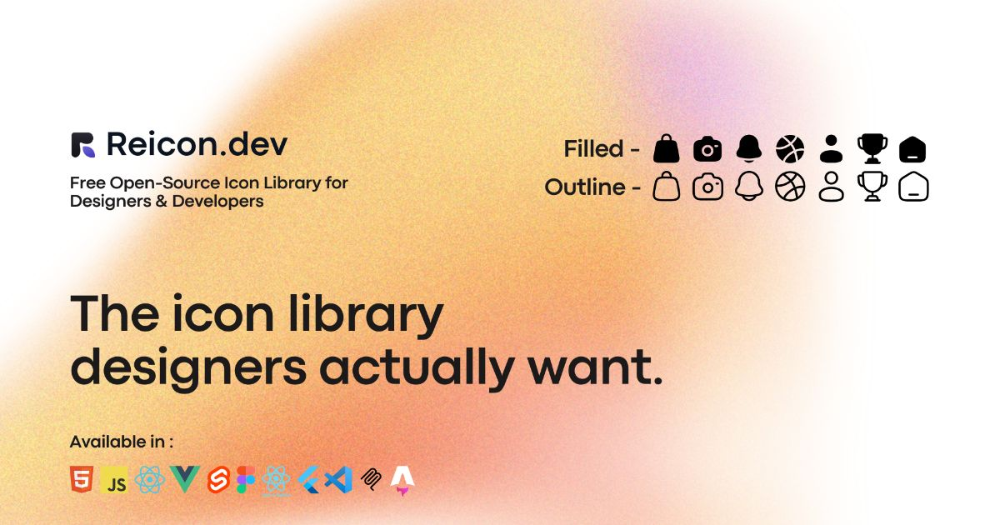

<p align="center">
  <a href="https://reicon.dev">
    
  </a>
</p>

<h1 align="center">Reicon</h1>

<p align="center">
  <strong>An open-source SVG icon library featuring 2,700+ icons with dedicated packages for React, React Native, Vue 3, Svelte, vanilla JavaScript, CDN runtime, Figma design workspace, VS Code code editor, and MCP Server for AI agents.</strong>
</p>

<p align="center">
  <a href="https://reicon.dev">Website</a> ·
  <a href="https://reicon.dev/icons">Browse Icons</a> ·
  <a href="https://reicon.dev/illustration">Browse Illustrations (71,000+)</a> ·
  <a href="https://reicon.dev/docs">Docs Guide</a> ·
  <a href="https://www.npmjs.com/package/reicon">npm</a>
</p>

<p align="center">
  <a href="https://www.npmjs.com/package/reicon"></a>
  <a href="https://www.npmjs.com/package/reicon-react"></a>
  <a href="https://www.npmjs.com/package/reicon-react-native"></a>
  <a href="https://www.npmjs.com/package/reicon-vue"></a>
  <a href="https://www.npmjs.com/package/reicon-svelte"></a>
  <a href="https://www.npmjs.com/package/reicon-mcp"></a>
  
  
  
</p>

<br/>

## &nbsp; Overview

Reicon provides a comprehensive set of SVG icons designed on a strict 24×24 pixel grid. The library is built for high-performance web applications, offering complete tree-shakeability, zero external dependencies, and optimized wrappers for multiple frameworks.

All icons are maintained in two weights:
*   **Outline**: 1.5px stroke-width with consistent corner radiuses.
*   **Filled**: Solid path structures designed for active states or highlighted UI elements.


## &nbsp; Packages & Ecosystem

| Logo | Package | Version | Downloads | Links |
| :---: | :--- | :--- | :--- | :--- |
|  | **`reicon`** | [](https://www.npmjs.com/package/reicon) |  | [Guide](docs/javascript/index.md) · [Source](./packages/reicon) |
|  | **`reicon-react`** | [](https://www.npmjs.com/package/reicon-react) |  | [Guide](docs/react/index.md) · [Source](./packages/reicon-react) |
|  | **`reicon-react-native`** | [](https://www.npmjs.com/package/reicon-react-native) |  | [Guide](docs/react-native/index.md) · [Source](./packages/reicon-react-native) |
|  | **`reicon-vue`** | [](https://www.npmjs.com/package/reicon-vue) |  | [Guide](docs/vue/index.md) · [Source](./packages/reicon-vue) |
|  | **`reicon-svelte`** | [](https://www.npmjs.com/package/reicon-svelte) |  | [Guide](docs/svelte/index.md) · [Source](./packages/reicon-svelte) |
|  | **`reicon-figma`** | — | — | [Guide](docs/figma/index.md) · [Source](./packages/reicon-figma) |
|  | **`reicon-vscode`** | [](https://marketplace.visualstudio.com/items?itemName=DevChauhan.reicon) | — | [Guide](docs/vscode/index.md) · [Source](./packages/reicon-vscode) |
|  | **`reicon_flutter`** | [](https://pub.dev/packages/reicon_flutter) |  | [Guide](./packages/reicon-flutter/README.md) · [Source](./packages/reicon-flutter) |
|  | **`reicon-mcp`** | [](https://www.npmjs.com/package/reicon-mcp) |  | [Guide](docs/mcp/index.md) · [Source](./packages/reicon-mcp) |
|  | **`reicon-svg`** | — | — | [Guide](docs/svg/index.md) · [Download](./public/reicon-icons.zip) |


## &nbsp; Quick Start

### React Usage

```tsx
import { Heart } from 'reicon-react';

function App() {
  return <Heart size={24} weight="Outline" color="#000000" />;
}
```

### Vue 3 Usage

```html
<script setup>
import { Heart } from 'reicon-vue';
</script>

<template>
  <Heart :size="24" weight="Filled" color="#000000" />
</template>
```

### Svelte Usage

```svelte
<script>
import { Heart } from 'reicon-svelte';
</script>

<Heart size={24} weight="Outline" color="#000000" />
```


### Flutter Usage

```dart
import 'package:reicon_flutter/reicon_flutter.dart';
import 'package:flutter_svg/flutter_svg.dart';

SvgPicture.string(
  reiconSvg(Reicon.outline.heart, size: 24),
)
```


### HTML / CDN Usage

```html
<!-- Load the library -->
<script src="https://unpkg.com/reicon/cdn/reicon.js"></script>

<!-- Render the web component -->
<re-icon icon="heart" weight="outline" size="24"></re-icon>
```


### MCP Server Usage

Connect AI agents to Reicon via the [Model Context Protocol](https://modelcontextprotocol.io):

```json
{
  "mcpServers": {
    "reicon": {
      "command": "npx",
      "args": ["reicon-mcp"]
    }
  }
}
```

Agents can search icons, preview SVG markup, and generate framework-specific code snippets. See the [MCP guide](docs/mcp/index.md) for tools reference and CLI usage.


## &nbsp; Agent Usage

Reicon provides dedicated LLM-friendly reference files so AI agents (Claude, Cursor, Copilot, etc.) immediately know how to install, import, and render Reicon icons across all frameworks.

| File | Purpose |
|------|---------|
| [`llms.txt`](public/llms.txt) | **Quick reference** — Agent workflow, install commands, usage snippets, and props tables for all 6 frameworks + CDN + MCP in one page |
| [`llms-full.txt`](public/llms-full.txt) | **Deep reference** — Package versions, full framework docs, TypeScript types, data architecture, comparison table, and expanded FAQ |
| [`llms-icons.txt`](public/llms-icons.txt) | **Icon directory** — All 2,700+ icons listed by category with kebab-case → PascalCase name mapping |

These files are publicly available at:
- https://reicon.dev/llms.txt
- https://reicon.dev/llms-full.txt
- https://reicon.dev/llms-icons.txt

When using the [MCP Server](docs/mcp/index.md), agents can also search icons, view SVG markup, and generate framework code programmatically with zero network calls.


## &nbsp; Project Structure

This project is organized as a monorepo holding the core dataset, package compilations, build scripts, and the showcase documentation site.

For a detailed file-by-file breakdown of the directory layout and file responsibilities, see the [Project Structure Guide](docs/project-structure.md).


## &nbsp; Design System

The documentation site uses a custom layout system built using CSS custom variables and Tailwind CSS utility tokens.

For the specifications on typography scales, responsive breakpoints, animations, and reusable site components, see the [Design System Guide](docs/design-system.md).

---

## &nbsp; Development & Building

### Running the Documentation Site
To start the React/Vite development server locally for the documentation website:
```bash
npm install
npm run dev
```

### Compiling Packages from Source
The core icons are maintained in `data/icon-data.json`, which acts as the single source of truth for the entire library.
1. Modify or add icons inside `data/icon-data.json`.
2. Run the compiler scripts to update all framework packages and CDN runtimes:
   ```bash
   npm run build:packages
   ```
3. Rebuild the website with updated package paths and prerendered SEO meta tags:
   ```bash
   npm run build:full
   ```


## &nbsp; Contributing

Contributions to the codebase, packages, or documentation are welcome. Please refer to our [Contributing Guidelines](.github/CONTRIBUTING.md) for conventions on pull requests, testing, and formatting.


## &nbsp; Our Stargazers

[](https://github.com/dqev/reicon/stargazers)


<br/>


## &nbsp; Credits

Reicon base icons are built using elements from:
* [Solar Icons](https://solar-icons.vercel.app/) designed by **480 Design** (CC BY 4.0) and package maintained by [Saoudi H.](https://github.com/saoudi-h/solar-icons) (MIT License)
* [Zappicon](https://zappicon.com/) (licensed under the [Zappicon License](https://zappicon.com/license))


## &nbsp; License

MIT License - Copyright (c) 2026 [Dev Chauhan](https://devchauhan.in). v1.2.0